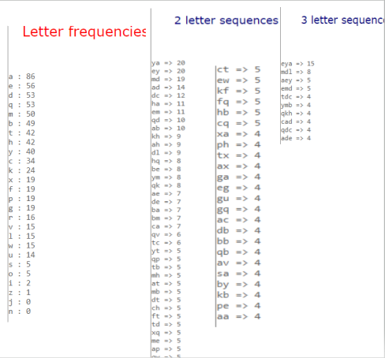
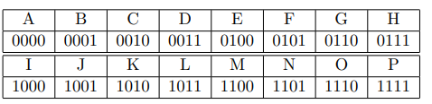
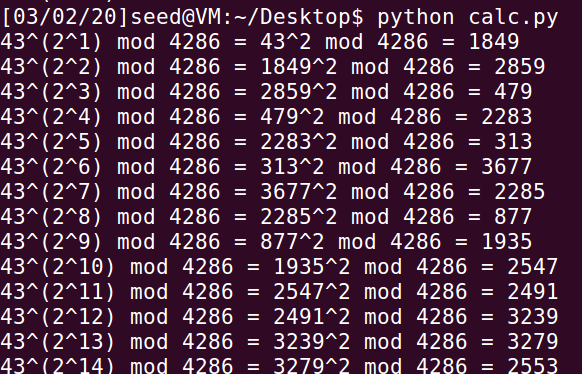
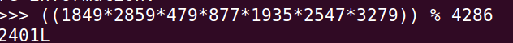

# CS4286 Assignment 01

* Name: Zhang Deheng
* SID: 55199998

[TOC]

------------------------------

## Q1: Security Service and Mechanisms ([Link](<https://www.comparitech.com/blog/information-security/2-7-billion-email-addresses-exposed-online/>))

* In Dec 2019, researchers found that an Elasticsearch database was exposed on the web, which includes 2.7 billion email addresses with more than 1 billion email addresses paired with a plain-text password. 
* Most of the emails were from Chinese domains including `qq.com`, `126.com`, while a few addresses are from Russian domains. Except for email addresses and passwords, information includes phone numbers, `MD5`, `SHA1`, `SHA256` hashes of email addresses (which can be used to ease searches of relational databases) may also be exposed. After finding the exposed data, researchers immediately took steps to notified the US ISP that hosted the IP address of the leaked database to take it down. However, when the database was disabled, the data was still exposed for more than a week, which might be taken advantage of by adversaries. 
* According to the verification by the researchers, all the emails with passwords originated from a dark web vendor who sold the records that included passwords stolen from Chinese internet giants in Jan 2017 (the event is the so-called “Big Asian Leak”). As mentioned by [HackRead](<https://www.hackread.com/hacker-selling-1-billion-chinese-internet-giants-data/>), more than 60 copies were sold for a \$615 price, most of the records from domains `Netease`, `Tencent`, `Sina`, and `Sohu`.  
* In this incident, **the type of attacker is a passive adversary**, because the attacker only attempts to get unauthorized access to the data, there is no evidence to prove that some active adversaries are starting to take advantage of the information. The attacker could be both insiders and outsiders because no information is given about how did the dark web vendor get the records. **The main security services were compromised is data confidentiality**, since the records of users are leaked. Besides, many people prefer to use the same email password combination, hackers may also use the exposed information to perform **credential stuffing**. If the hackers can gain access to an account, they may change the password and do some other **types of attack (spam, phishing, fraud)**. **Therefore, integrity, availability and access control may also be compromised.**  
* To avoid this event, an obvious mechanism is the **encipherment** which provides **confidentiality**. Because in the leaked records, 1 billion passwords were stored in plain-text, it will be better to use **hash with salt** to store the password. Besides, the internet companies should also enhance the mechanism **access control model** which provides better **access control** of the database.  

------------------------------

## Q2: Substitution Cipher

* Key: 

  ```
  plain alphabetic: 
  abcdefghijklmnopqrstuvwxyz
  key: 
  TRXCAPLYMZOGVDQFJHBEKSWIUN
  (or)
  TRXCAPLYMZOGVDQFNHBEKSWIUJ
  ```

* Result: 

  ```
  in the third week of november, in the year 1895, a dense
  yellow fog settled down upon london. from the monday
  to the thursday i doubt whether it was ever possible
  from our windows in baker street to see the loom of
  the opposite houses. the first day holmes had spent in
  cross-indexing his huge book of references. the second
  and third had been patiently occupied upon a subject
  which he had recently made his hobby–the music of the
  middle ages. but when, for the fourth time, after pushing
  back our chairs from breakfast we saw the greasy, heavy
  brown swirl still drifting past us and condensing in
  oily drops upon the window-panes, my comrade’s impatient
  and active nature could endure this drab existence no
  longer. he paced restlessly about our sitting-room in
  a fever of suppressed energy, biting his nails, tapping
  the furniture, and chafing against inaction.
  ```

* Steps: 

  * I used the [online frequency analysis tool](<http://www.richkni.co.uk/php/crypta/freq.php>) to analyze the character frequency and compared it with the frequency [bigram](<https://en.wikipedia.org/wiki/Bigram>) and [trigram](<https://en.wikipedia.org/wiki/Trigram>). 

    

  * According to the letter frequencies, bigram, trigram, and two letter words, three letter words. I can find that

    ```
    e => a, t => e, z => n, he => ya, th => ey, ing => mdl... 
    ```

  * I use the command `tr` in Linux system to substitute the characters

    ```
    tr 'EGHINTZ' 'alymden' < cipher.txt > test.txt
    ```

  * Based on the output, continue observing the words, and try whether I can do some substitution to get a word, to analyze the result better, I wrote the code to select words with specific length in `test.txt`:

    ```python
    import operator
    length = input("Length of the word: ")
    with open('test.txt', 'r') as file:
    	words = file.read().split()
        dic = {}
        for word in words:
            if len(word) == length:
                if not word in dic :
                    dic[word] = 1
                else:
                    dic[word] += 1
         sorted_dic = sorted(dic.items(), key=lambda kv:kv[1])
         print(sorted_dic)
    ```

  * Repeat the previous three steps until all words can be found.

  * **Finally, since the frequency for `J` and `N` are zero, we can get two correct keys.** 

---------------------------------

## Q3: Modes of Operation and ‘shift cipher’

* Plaintext: ‘IAMALICE’, Key: 4

  

* (a) Encrypt the plaintext $P$ using $CBC$ mode with $IV = 0001$.

$$
C_0 = E_k(P_0\oplus IV) = E_k(1000\oplus 0001) = E_k(1001) = E_k(J) = N(1101) \\
C_1 = E_k(P_1\oplus C_0) = E_k(0000\oplus 1101) = E_k(1101) = E_k(N) = B(0001)\\
C_2 = E_k(P_2\oplus C_1) = E_k(1100\oplus 0001) = E_k(1101) = E_k(N) = B(0001)\\
C_3 = E_k(P_3\oplus C_2) = E_k(0000\oplus 0001) = E_k(0001) = E_k(B) = F(0101)\\
C_4 = E_k(P_4\oplus C_3) = E_k(1011\oplus 0101) = E_k(1110) = E_k(O) = C(0010)\\
C_5 = E_k(P_5\oplus C_4) = E_k(1000\oplus 0010) = E_k(1010) = E_k(K) = O(1110)\\
C_6 = E_k(P_6\oplus C_5) = E_k(0010\oplus 1110) = E_k(1100) = E_k(M) = A(0000)\\
C_7 = E_k(P_7\oplus C_6) = E_k(0100\oplus 0000) = E_k(0100) = E_k(E) = I(1000)\\
C = NBBFCOAI
$$

* (b) Encrypt the plaintext $P$ using $CBC$ mode with $IV = 0101$. How does your ciphertext
  compare to that in 2(a).
  $$
  C_0 = E_k(P_0\oplus IV) = E_k(1000\oplus 0101) = E_k(1101) = E_k(N) = B(0001)\\
  C_1 = E_k(P_1\oplus C_0) = E_k(0000\oplus 0001) = E_k(0001) = E_k(B) = F(0101)\\
  C_2 = E_k(P_2\oplus C_1) = E_k(1100\oplus 0101) = E_k(1001) = E_k(J) = N(1101)\\
  C_3 = E_k(P_3\oplus C_2) = E_k(0000\oplus 1101) = E_k(1101) = E_k(N) = B(0001)\\
  C_4 = E_k(P_4\oplus C_3) = E_k(1011\oplus 0001) = E_k(1010) = E_k(K) = O(1110)\\
  C_5 = E_k(P_5\oplus C_4) = E_k(1000\oplus 1110) = E_k(0110) = E_k(G) = K(1010)\\
  C_6 = E_k(P_6\oplus C_5) = E_k(0010\oplus 1010) = E_k(1000) = E_k(I) = M(1100)\\
  C_7 = E_k(P_7\oplus C_6) = E_k(0100\oplus 1100) = E_k(1000) = E_k(I) = M(1100)\\
  C = BFNBOKMM
  $$

  * The cipher text is slightly different

* (c) Use your answer from 2(b). If the MSB bit of $C_2$ becomes an error($C_2 = F(0101)$), what is the recovered plaintext?
  $$
  P^\prime_0 = D_k(C_0) \oplus IV = N \oplus IV = 1101 \oplus 0101 = I(1000)\\
  P^\prime_1 = D_k(C_1) \oplus C_0 = B \oplus C_0 = 0001 \oplus 0001 = A(0000)\\
  P^\prime_2 = D_k({\color{red}C_2}) \oplus C_1 = {\color{red}B} \oplus C_1 = {\color{red}0001} \oplus 0101 = {\color{red}E(0100)}\\
  P^\prime_3 = D_k(C_3) \oplus {\color{red}{C_2}} = N \oplus {\color{red}{C_2}} = 1101 \oplus {\color{red}{0}}101 = {\color{red}{I}}({\color{red}1}000)\\
  P^\prime_4 = D_k(C_4) \oplus C_3 = K \oplus C_3 = 1010 \oplus 0001 = L(1011)\\
  P^\prime_5 = D_k(C_5) \oplus C_4 = G \oplus C_4 = 0110 \oplus 1110 = I(1000)\\
  P^\prime_6 = D_k(C_6) \oplus C_5 = I \oplus C_5 = 1000 \oplus 1010 = C(0010)\\
  P^\prime_7 = D_k(C_7) \oplus C_6 = I \oplus C_6 = 1000 \oplus 1100 = E(0100)\\
  P^\prime = IAEILICE
  $$

* (d) Use your answer from 2(b). If the block $C_2$ is lost (receiver does not realize it is missing),
  what is the recovered plaintext?

  * Know Information: 
    $$
    C_0 = B(0001)\\
    C_1 = F(0101)\\
    C_2 = B(0001)\\
    C_3 = O(1110)\\
    C_4 = K(1010)\\
    C_5 = M(1100)\\
    C_6 = M(1100)\\
    IV  = 0101
    $$

  * Decryption
    $$
    P^\prime_0 = D_k(C_0) \oplus IV = N \oplus IV = 1101 \oplus 0101 = I(1000)\\
    P^\prime_1 = D_k(C_1) \oplus C_0 = B \oplus C_0 = 0001 \oplus 0001 = A(0000)\\
    P^\prime_2 = D_k(C_2) \oplus C_1 = N \oplus C_1 = 1101 \oplus 0101 = I(1000)\\
    P^\prime_3 = D_k(C_3) \oplus C_2 = K \oplus C_2 = 1010 \oplus 0001 = L(1011)\\
    P^\prime_4 = D_k(C_4) \oplus C_3 = G \oplus C_3 = 0110 \oplus 1110 = I(1000)\\
    P^\prime_5 = D_k(C_5) \oplus C_4 = I \oplus C_4 = 1000 \oplus 1010 = C(0010)\\
    P^\prime_6 = D_k(C_6) \oplus C_5 = I \oplus C_5 = 1000 \oplus 1100 = E(0100)\\
    P^\prime = IAILICE
    $$


-------------------------------------

## Q4: Number Theory

* $X=55199998,Y=9998$

* To factorization $n$, we can use the prime numbers from $2$ to $\sqrt{n}$, if $n$ is divisible by one of the prime number $p$, then keep doing $n = n/p$ until $n$ is not divisible, if the final result is not $1$, it must be another prime number in the factorization.  

* (a) Compute $43^Y\ mod\ 4286$ using the square-and-multiply method.

  * Compute binary of $Y$: 
    $$
    9998_{10} = 10011100001110_2 = 2^{13} + 2^{10} + 2^{9} + 2^{8} + 2^{3} + 2^{2} + 2^{1}
    $$

  * Square and multiply: 

    * Code: 

      ```python
      temp = 43
      for i in range(14):
      	x = (temp**2)%4286
      	print("43^(2^%d) mod 4286 = %d^2 mod 4286 = %d"%(i+1, temp, x))
      	temp = x
      ```

    * Result: 

      

  * Final answer: 

    
    $$
    43^{9998} = (1849*2859*479*877*1935*2547*3279)\ mod\ 4286 = 2401
    $$

* (b) Calculate $\phi(Y)$. 

  * Factorization: $9998 = 2*4999$ 
  * According to Fermat’s little theorem $\phi(9998) = (2-1)*(4999-1)=4998$

* (c) $gcd(X, 928374827)$

  * By using the following code: 

    ```python
    def gcd(a,b):
    	if a > b :
    		if b == 1:
    			return a
    		print("%d = %d*%d+%d"%(b, a, a/b,a%b))
    		x = gcd(b, a%b);
    		return x
    	else:
    		return gcd(b,a)
    print(gcd(55199998, 928374827))
    ```

  * Get the answer: $gcd(55199998, 928374827)$

    ```
    928374827 = 55199998*16+45174859
    55199998 = 45174859*1+10025139
    45174859 = 10025139*4+5074303
    10025139 = 5074303*1+4950836
    5074303 = 4950836*1+123467
    4950836 = 123467*40+12156
    123467 = 12156*10+1907
    12156 = 1907*6+714
    1907 = 714*2+479
    714 = 479*1+235
    479 = 235*2+9
    235 = 9*26+1
    ```

* (d) Find integers $x​$ and $z​$ such that $x·X+z·928374827 = gcd(X,928374827)​$.
  $$
  1 = 235 - 9*26 \\
    = 235 - (479 - 235*2)*26 = -479*26 + 235*53\\
    = -479*26 + (714 - 479*1)*53 = -479*79 + 714*53 \\
    = -(1907 - 714*2)*79 + 714*53 = -1907*79 + 714*211 \\
    = -1907*79 + (12156 - 1907*6)*211 = 12156*211 - 1907*1345 \\
    = 12156*211 - (123467 - 12156*10)*1345 = -123467*1345 + 12156*13661 \\
     = -123467*1345 + (4950836 - 123467*40)*13661 = 4950836*13661 - 123467*547785\\
  = 4950836*13661 - (5074303 - 4950836*1)*547785 \\
  = -5074303*547785 + (10025139 - 5074303*1)*561446 \\
  = 10025139*561446 - 5074303*1109231 \\
  = 10025139*561446 - (45174859 - 10025139*4)*1109231 \\
  = -45174859*1109231 + 10025139*4998370 \\
  = -45174859*1109231 + (55199998 - 45174859*1)*4998370 \\
  = 55199998*4998370 - 45174859*6107601 \\
  = 55199998*4998370 - (928374827 - 55199998*16)*6107601 \\
  = -928374827*6107601 + 55199998*102719986
  $$

  * Therefore, $x = 102719986$, $z = -6107601$ 

* (e) Choose any prime number $Z​$ that is smaller than $X​$. Calculate $X^X\ mod\ Z​$

  * Choose $Z = 2$
  * $X^X\ mod \ Z=(X\ mod\ Z)^X\ mod\ Z= (55199998\ mod\ 2)^{55199998}\mod 2=0$  

---------------------------

## Q5: El-Gamal

* $p=19$ and $g = 3$

* (a) Suppose the private key is $x = 7 $. Compute the public key $y$.
  $$
  y=g^x\ mod\ p = 3^7\ mod\ 19 = ((3^3\mod 19)^2\mod19) *( 3\mod 19)\mod 19 = 2
  $$

* (b) Encrypt the message $M = 8$ using the public key above and $r = 8$.
  $$
  A = g^r\ mod\ p = 3^8\ mod\ 19 = 6\\
  B = My^r\ mod\ p = 8*2^8\ mod\ 19 = 2^{11}\ mod\ 19 = 15 \\
  C = (A,B) = (6, 15)
  $$

* (c) Verify your calculation in part (b) above by decrypting the ciphertext you obtained in
  part (b)
  $$
  K = A^x\ mod\ p = 6^{7}\ mod\ 19 = 9 \\
  $$

  * Find $9^{-1}(mod\ 19)$  
    $$
    19 = 2*9 + 1 \\
    19 - 2*9 = 1 \\
    19 + 19*9-2*9 = 19*9+1\\
    19 + 17*9 = 19*9+1\\
    17*9\equiv 1(mod\ 19)\\
    K^{-1} = 17 \\
    $$

  * Decrypt: The result is the same as the plain text, the calculation is correct
    $$
    M=BK^{-1}\ mod\ p = (15*17)\ mod\ 19 = 8
    $$


--------------------------------

## Q6: Diffie-Hellman

* $p = 19$ and $g = 10$.

* (a) Alice picks $x = 7 $, and Bob picks $y = 11$. What is the shared key $K$ resulting from the
  exchange?
  $$
  \phi(19) = 18, gcd(19,10)=1\\
  K = g^{xy}\ mod\ p = 10^{7*11}\ mod\ 19 \\
  = 10^{77}\ mod\ 19 = 10^{4*18+5}\ mod\ 19 = 10^5 \ mod\ 19 = 3
  $$

* (b) How would you modify the exchanged messages in $DH$ to prevent its main weakness?
  Clearly state all your assumptions (including any additional cryptographic algorithm or
  material needed) and the notation you used.

  * The weakness of $DH$ is man-in-middle attack
  * To avoid this weakness, we can use **digital signature(implemented by RSA)** to sign the shared public key: 
    * Set up: 
      * $n=p^\prime q^\prime$, where $p^\prime q^\prime$ are large prime (say 512 bits long each)
      * select $e$ such that $gcd(e,(p-1)(q-1))=1$
      * $ed \equiv 1\ mod\ (p-1)(q-1)$
      * Signing (Private) Key : $d$
      * Verification (Public) Key :$ (e, n)$
    * Signature Generation: $S=A^d\ mod\ n$, where $A$ is the shared public key
    * Then $(S,A)$ is sent to Bob
    * Signature Verification: If $S^e\ mod\ n = A$, output is valid and Bob can trust it is from Alice; otherwise, output invalid(i.e. it is changed by man-in-middle attack)
    * Assumption, the shared public keys: $A = g^x\ mod\ p$, $B=g^y\ mod\ p$  satisfy $A<n, B<n$ 
