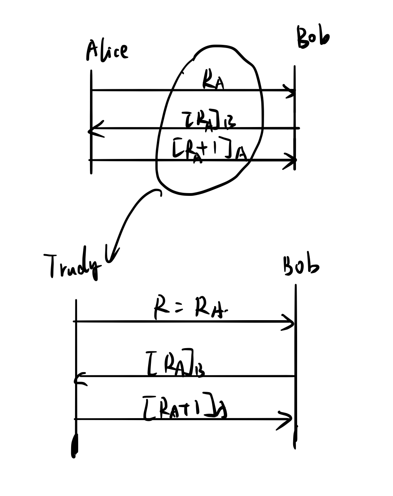
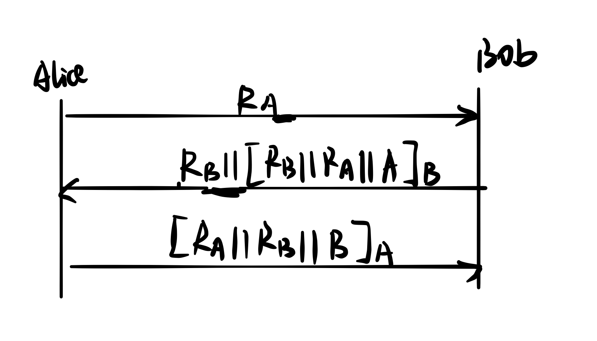
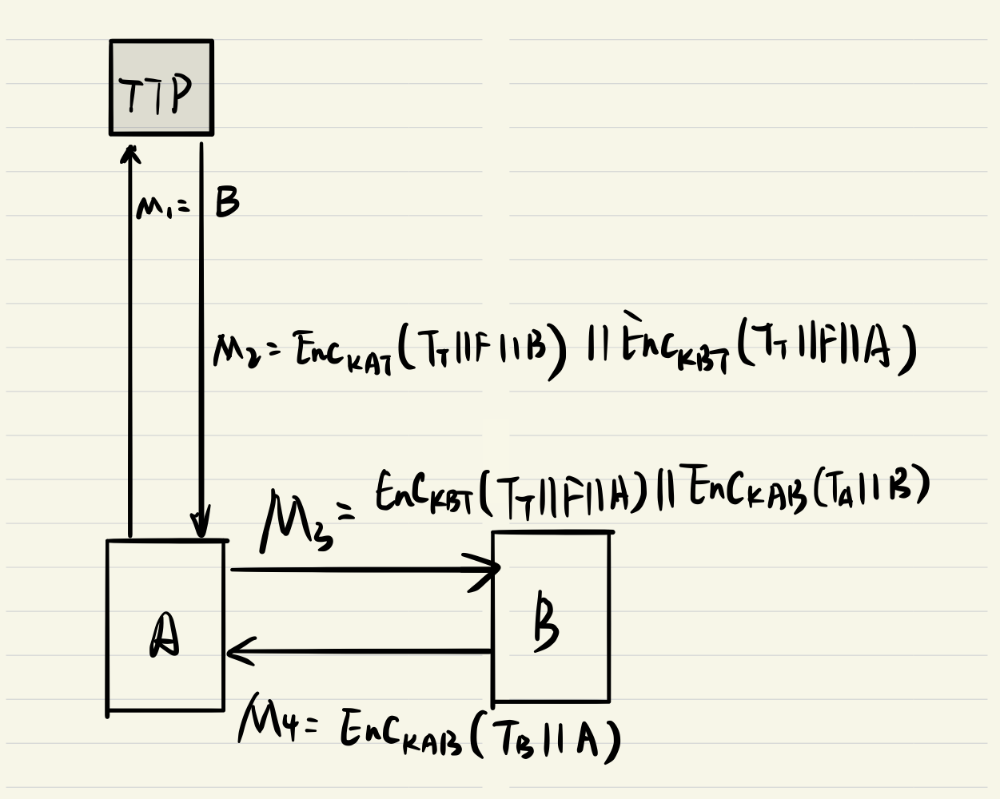
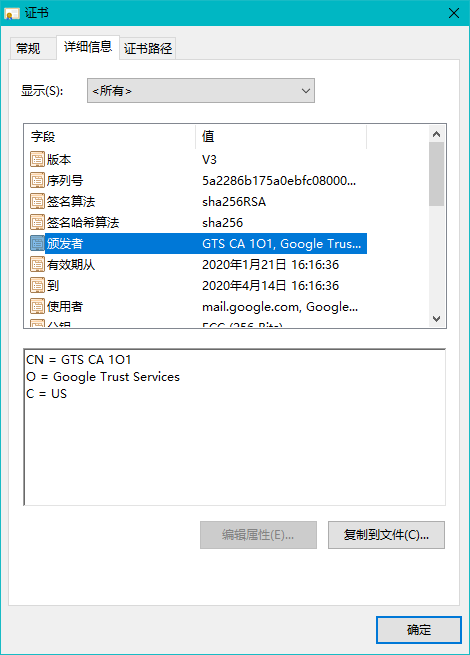
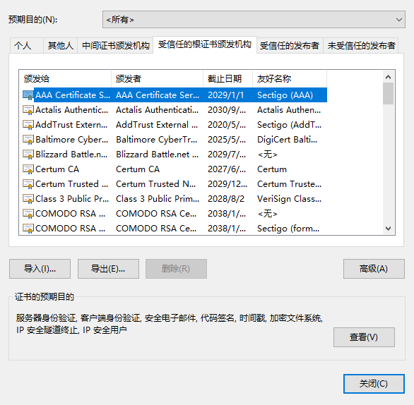

# CS4286: Assignment 2

* Name: Zhang Deheng
* SID: 55199998

[TOC]

## 1. Risk and the impact of security

- ***Real-name system*** is a system in which users can register an account on a blog, website or bulletin board system using their legal name. It is used by several countries including China, Germany, South Korea as well as some famous social networking sites including Facebook, Twitter. [[1]](<https://en.wikipedia.org/wiki/Real-name_system>) The main purpose of this system is to avoid anonymous crime.  In some perspective, it does make the online system more secure since it increases accountability and makes the system a more professional appearance. [[2]](<http://www.managingcommunities.com/2011/01/20/usernames-vs-real-names-on-your-community-pros-and-cons/>) However, there are unintended consequences of this countermeasure. 
- ***Displacement***:  Since the public network (system) is real-name based, criminals might be encouraged implicitly to use other anonymous systems or networks like dark web. As a consequence, the dark web might be enlarged. Therefore displacement consequences might be involved. 
- ***Insecure norms***: As a consequence of displacement, more techniques to provide anonymity might be developed to support a larger number of anonymous users on the dark web. Therefore, insecure behaviors are encouraged. 
- ***Additional costs***: Use of real-name system also increase additional costs. For normal users, they need to provide more information such as citizenship ID or mobile binding when registering a new account. For system provider (either government or website provider), they need to provide additional protection for user information since it is more dangerous to leak the information when the system is real-name. 
- ***Misuse***: The information of the user might be misused. Once the information is not well protected, real-name information can be more harmful to the users since attackers can identify each one of target more accurately. 
- ***Amplification***: The real-name system is considered to reduce cyberbullying since everyone is expected to behave more appropriately with real-name. However, some user may prefer to use an anonymous account to share some unfair things happened to them which they do not want to share with real-name to avoid bullying. Once their real-name is published, they may be bullied in real life. This causes an increase in the behavior targeted for prevention.  
- ***Disruption***: As mentioned in the previous paragraph, some users may not willing to share their feelings with a real name. If the real-name system is enforced, their operation could be interrupted. 

## 2. Digital Signature

### (a) ElGamal & DSA

* Can these algorithms be used to encrypt a message?
  * These algorithms cannot be used to encrypt messages, because these algorithms are not directly comparing the digest. 
  * For RSA, the role of public key and private key can be changed, which is the reason that it can be used as both encryption and signature algorithm. (we can call this property as duality) Besides, it is based on the big number fraction problem. 
  * For these two algorithms, the role of private key and public key cannot be changed. Therefore, we have to use different computation algorithm for DSA and ElGamal when used in encryption and signature respectively. Besides, these algorithms are based on the DLP. 
* Main difference in how you verify the validity of the message with these schemes when compared to RSA
  * RSA (based on big number fraction) directly compares the digest of message $M$ during the verification stage
  * ElGamal (based on DLP) compares the base raised to the power of digest $g^{H(m)}\equiv y^rr^s(\ mod\ p)$, and DSA (based on DLP) compares the base raised to the random selected number with the participation of the digest $g^k \equiv g^{H(m)s^{-1}}g^{xrs^{-1}} (mod\ p\ mod\ q)$. The digest is not directly used for DSA and ElGamal.

### (b) An example of ElGamal

* Set up: 

  * Base $g = 7$

  * Private key $x = 16$

  * Modular $p = 71$

  * Public key $y = g^x\ mod\ p = 7^{16}\ mod\ 71 = 19$

    ```
    16 = 2^4
    7^(2^1) mod 71 = 7^2 mod 71 = 49
    7^(2^2) mod 71 = 49^2 mod 71 = 58
    7^(2^3) mod 71 = 58^2 mod 71 = 27
    7^(2^4) mod 71 = 27^2 mod 71 = 19
    ( 19 ) mod 71 = 19
    ```

* Sign: 

  * Random $k = 9$

  * $r = g^k \mod\ p = 7^{9}\ mod\ 71 = 47$

    ```
    9 = 2^3 + 2^0
    7^(2^1) mod 71 = 7^2 mod 71 = 49
    7^(2^2) mod 71 = 49^2 mod 71 = 58
    7^(2^3) mod 71 = 58^2 mod 71 = 27
    ( 7 * 27 ) mod 71 = 47
    ```

  * Digest $H(m) = 13$

  * $s = (H(m)-xr)k^{-1}\ mod\ (p-1)$ 

    * Find $k^{-1}(mod\ (p-1)) = 9^{-1}\ (mod\ 70)$
      $$
      70 = 9*7+7 \\
      9 = 7*1+2 \\
      7 = 2*3 + 1\\
      1 = 7 - 2*3 \\
      1 = 7 - (9 - 7)*3 = 7*4 - 9*3\\
      1 = (70-9*7)*4 - 9*3 = 70*4 - 9*31\\
      9^{-1}\equiv 39\ (mod\ 70) \\
      $$

    * Find $s$
      $$
      s = (H(m)-xr)k^{-1}\ mod\ (p-1) \\
      = (13 - 16*47)*39\ mod\ 70 \\
      = 19
      $$

  * Send the signature as $(r,s) = (47, 19)$, as well as message $M$

* Verify:

  * $0<47<71$, $0 <19< 70$

  * $g^{H(M)}\ mod\ p = 7^{13}\ mod\ 71 = 28$

    ```
    13 = 2^3 + 2^2 + 2^0
    7^(2^1) mod 71 = 7^2 mod 71 = 49
    7^(2^2) mod 71 = 49^2 mod 71 = 58
    7^(2^3) mod 71 = 58^2 mod 71 = 27
    ( 7 * 58 * 27 ) mod 71 = 28
    ```

  * $y^r r^s\ mod\ p = 19^{47}*47^{19}\ mod\ 71$

    * $19^{47}\ mod\ 71 = 9$

      ```
      47 = 2^5 + 2^3 + 2^2 + 2^1 + 2^0
      19^(2^1) mod 71 = 19^2 mod 71 = 6
      19^(2^2) mod 71 = 6^2 mod 71 = 36
      19^(2^3) mod 71 = 36^2 mod 71 = 18
      19^(2^4) mod 71 = 18^2 mod 71 = 40
      19^(2^5) mod 71 = 40^2 mod 71 = 38
      ( 19 * 6 * 36 * 18 * 38 ) mod 71 = 9
      ```

    * $47^{19}\ mod\ 71 = 11$

      ```
      19 = 2^4 + 2^2 + 2^1
      47^(2^1) mod 71 = 47^2 mod 71 = 8
      47^(2^2) mod 71 = 8^2 mod 71 = 64
      47^(2^3) mod 71 = 64^2 mod 71 = 49
      47^(2^4) mod 71 = 49^2 mod 71 = 58
      ( 47 * 8 * 58 ) mod 71 = 11
      ```

    * $y^r r^s\ mod\ p = 19^{47}*47^{38}\ mod\ 71 = 9*11 \ mod\ 71 = 28$

    * Therefore, the message is successfully verified

## 3. Mutual Authentication

### (a)

* This protocol is mainly vulnerable to **replay attack**

* Reason

  * The reason of insecure is Alice is not authenticated to Bob, because of the lack of freshness

  * Not masquerade, because attacker can not make up message to fool Alice or Bob since he does not know the private key

  * Not reflection, because reflection attack sends the message generated by one person to himself, which can only be used in symmetric scheme

  * **Man-in-the-middle**: Probably, when Alice sends $R$ to Bob, Trudy can intercept it and send $R+1$ as a request to Alice. Alice then sends back $[R+1]_A$ to Trudy, which can be used to fool Bob. 

  * **Replay attack** can be performed once Alice and Bob finish one authentication process, the attacker can send $R$ of previous round to Bob, and get $[R]_B$. Since he knows $[R+1]_A$ of previous round, he can pretend to be Alice. 

    

### (b)

* Assume all the public keys are certificated by trusted CA
* To achieve mutual authentication, we can replace the messages by
  * $R_A$
  * $R_B||[R_B||R_A||A]_B$
  * $[R_A||R_B||B]_A$ 
  * where $A, B$ are public available identifier of Alice and Bob respectively, and $R_A, R_B$ are random number generated by Alice and Bob respectively. 
  * Nonce $R_B$ is provided to make sure the freshness of Alice’s authentication

  

## 4. Key Management

* Protocol diagram

  

* Assumptions and Notations:

  *  $TTP$ shares key $KAT, KBT$ with $A,B$ respectively, and is trusted by both $A$ and $B$. 
  * $A, B$ are identifiers of Alice and Bob
  * $F$ contains keying material
  * $T_T, T_A, T_B$ are timestamps generated by $TTP, A, B$ respectively
  * $KAB$ is the key generated by $F$ and shared by $A, B$ (although no explicit key authentication required, mutual authentication of Alice and Bob require the shared key)
  * $MDC$ can be appended to the each plaintext before encryption
  * $M_1, M_2, M_3, M_4$ are four messages in the order of being sent

* Actions:

  * $M_1$: Alice send the target of sharing key to TTP
  * $M_2$: TTP generate timestamp $T_T$ and key material $F$, and send encrypted message as shown in the diagram. 
  * $M_3$: Alice decrypt $Enc_{KAT}(T_T||F||B)$, and use $F$ to generate $K_{AB}$ (may use hash function). The she sends the other part of $M_2$ as well as the authentication message encrypted by $K_{AB}$ to $B$ 
  * $M_4$: Bob decrypt $Enc_{KBT}(T_T||F||A)$, and use $F$ to generate $K_{AB}$ (may use hash function). The he replies the authentication message by using the shared $K_{AB}$

* Relationships and Analysis

  * TTP is authenticated to Alice and Bob, but not Alice and Bob are not authenticated to TTP. Alice and Bob are mutual authenticated. 
  * Original authentication is provided by symmetric encryption, while freshness is provided by timestamps
  * This is a key agreement protocol, neither Alice nor Bob have key control.
  * This is explicit key authentication, since mutual authentication of Alice and Bob is established. 

## 5. Digital Certificates

* (a) Find out who issued the certificate for https://mail.google.com and how long the certificate will be valid.

  

  * Issuer: Google Trust Services （GTS CA 1O1）
  * Issued on Jan 21, 2020 at 16:16:36. Expired on April 14 at 16:16:36. The valid duration last for 84 days

* (b) Find out or estimate how many certificates (approximately, no need to count them explicitly) your browser contains.

  

  * There are approximately 90 certificates in my browser

* (c) What is the significance of a CA certificate being contained in the browser?

  * When the browser connects a server, it will verify the certificates of the target server which may be signed by some CA certificate issuer stored in the browser or “child node” of the CA certificate issuer. Therefore, **browser can build a trust chain** to anyone of the server visited, and verify the certificates of the servers before secure connection. 
  * It can also be used to verify the websites belonged to the stored certificates’ issuer.

* (d) The identity of the certificate for the question above is a DNS hostname. Certificates can also be used for signing and encrypting email. For a certificate used for email, what identifier would be used as the identity in the certificate?

  * The identifier should be the **email address**