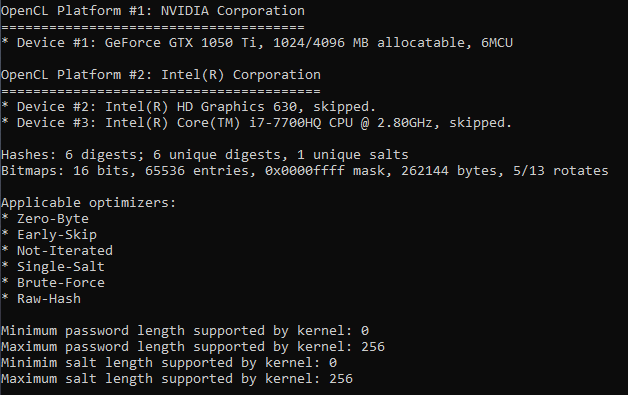
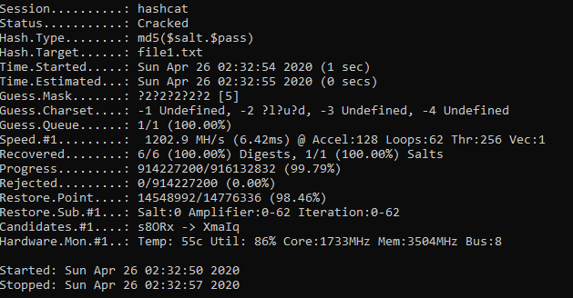
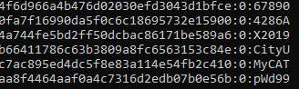
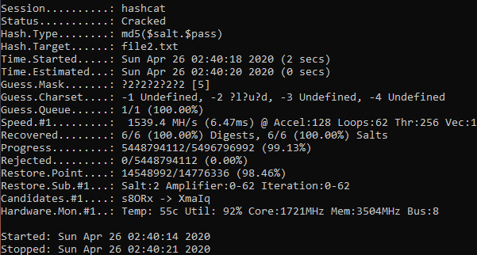
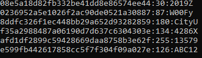
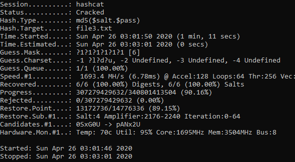
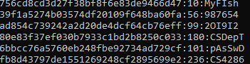

# CS4286: Assignment3 

* Name: Zhang Deheng
* SID: 55199998

[TOC]

## 1. Security Services

* Zoom is the video-conferencing software widely used recently due to the outbreak of COVID-19[[1]](<https://en.wikipedia.org/wiki/Zoombombing#cite_note-Tribune-5>). “Zoombombing” is an unexpected issue during the conference by using Zoom. In this case, uninvited attendees break into and disrupt the meeting [[2]](<https://www.cnet.com/how-to/4-zoom-security-settings-to-change-now-to-prevent-zoombombing/>). The attacker may join a session by using the shared password on the internet or simply using the link which allows legitimate users to join[[1]](<https://en.wikipedia.org/wiki/Zoombombing#cite_note-Tribune-5>). **The main failing services are access control and entity authentication.** 
* Access control is compromised since the communication resource for a limited number of users is used by the attacker if they now the password, which should be protected by the access control mechanism. The technical vulnerability is that **there is no specific access control mechanism** for a session, anyone with a correct session password is allowed to access the conference. 
* Entity authentication is compromised since there might be a masquerade situation. The zoom link for a legitimate user can be directly shared with the attackers with the password appended to the URL. In this case, if the attacker attends the conference through the shared link, the username presented in the meeting is the same as the legitimate user. The technical vulnerability is that **there is no freshness and data origin authentication provided**. The authentication is only based on the fixed password for each session by using challenge-and-response. 
* Besides, **confidentiality and availability** might also be compromised since the conference content might be exposed and if the attackers cannot be removed, it will be a deny-of-conference-service. 
* For access control, we can use the **access control model mechanism**. A role-based access control list can be constructed for each meeting. In this way, the host of the meeting can choose a white list of roles who can attend the meeting. For each role, user IDs are stored in a well-protected file. Therefore, attackers cannot attend the conference since they are not in the whitelist. Host can also store the users usually permitted to join the conference in a specific role list. For entity authentication, the mechanism **authentication protocol** should be used. A nonce should be generated by the host and sent to the user who wants to join a session, and a response produced by MAC or encryption by a token stored locally. The token is generated and stored once the user is login into his/her zoom account. In this way, each time a user wants to join a session, entity authentication is provided. 

## 2. Password File

* $y = H(s; password) \oplus password$: It is **secure** against precomputed dictionary attack since we cannot get the $password$ or $h(password)$ with a known $s$. We need to pre-compute all the possible $H(s; password)\oplus password$ to launch dictionary attack. Besides, hash and XOR are fast operations,m which is efficient for verification
* $y = H(s) \oplus H(password):$ It is **insecure** against precomputed dictionary attack since if we know $s$, we can compute $H(password) = y \oplus H(s)$. Therefore, we can use the dictionary with pre-computed $H(password)$.  
* $y = E_s(H(password)): $ It is **insecure** against precomputed dictionary attack since if we know $s$, we can compute $H(password) = D_s(y)$ where $D$ is the decryption of AES algorithm. Therefore, we can use the dictionary with pre-computed $H(password)$. 
* $y = MAC_{password}(s): $ It is **secure** against precomputed dictionary attack since we cannot get the $password$ or $h(password)$ with a known $s$. We need to pre-compute all the possible $MAC_{password}(s)$ to launch a dictionary attack. 

## 3. TLS

* (a) There are 5 ciphersuites in the latest specification TLS 1.3 according to [openssl_wiki](<https://wiki.openssl.org/index.php/TLS1.3>).

  * TLS_AES_256_GCM_SHA384
  * TLS_CHACHA20_POLY1305_SHA256
  * TLS_AES_128_GCM_SHA256
  * TLS_AES_128_CCM_8_SHA256
  * TLS_AES_128_CCM_SHA256

* (b) Assume Alice ($A$) and Bob ($B$) are sharing a session key

  * TLS: the transport layer security protocol

  * AES_128_CCM: Authentication and encryption algorithm is 128-bit AES operating in Counter_CBC_MAC (CCM) mode. 

  * SHA_256: The hash function is 256-bit SHA

  * The procedure of generating session keys and encrypting the data messages

    1. $A \rightarrow B: 5\ Cipher\ suites, TLS\ 1.3, R_A$
    2. $A \leftarrow B: TLS\_AES\_128\_CCM\_SHA256, Cert_B, R_B$
    3. $A \rightarrow B: \{S\}_B, SHA_{256}(SHA_{256}(msgs))$
    4. $A \leftarrow B: SHA_{256}(SHA_{256}(msgs))$
    5. $A \leftrightarrow B: AES\_128\_CCM_{K}(data)$  

    * Where
      * $R_A$ and $R_B$ are nonces generated by $A$ and $B$ respectively
      * $Cert_B$ is the certificate of the public key of $B$
      * $\{\}_B$ represents the ciphertext encrypted by $B$’s public key
      * $S$ is randomly chosen by $A$
      * $K = SHA_{256}(S, R_A, R_B)$

## 4. Key agreement/IKE

* (a) i. Authenticity and Key agreement

  * Authenticity: $A$ and $B$ are not authenticated to each other since there is no freshness included in the $proof_A$ and $proof_B$ and the nonce encrypted by the public key is not requred to be decrypted. **Once trudy knows Alice's and Bob’s IP address**, he can intercept the message and lauch man-in-the-middle attack. 
  * Key agreement: Key agreement is achieved since no one has the key control. 
    * Key control: Neither entity of $A$ and $B$ has key control.
    * Key authentication:  $g^{ab}\ mod\ p$ is only possible to be known by only one entity for both $A$ and $B$ despite themselves (which is an implicit key authentication).
      * However, according to the definition of key authentication, the entity that shares a key with you should be identified. If we define “identified” as “authenticated”, it is neither an implicit nor an explicit key authentication. 

* (a) ii. Modified protocol

  1. $A \rightarrow B: \{g^a\ mod\ p\}_{Bob}, \{“Alice”\}_{Bob}$
  2. $A \leftarrow B: \{g^b\ mod\ p\}_{Alice}, \{“Bob”\}_{Alice}, proof_B$ 
  3. $A \rightarrow B: proof_A$ 

  * Where 
    * $proof_A = h(g^{ab}\ mod\ p, g^a\ mod\ p, g^b\ mod\ p, “Alice”, T_A)$ 
    * $proof_B =  h(g^{ab}\ mod\ p, g^a\ mod\ p, g^b\ mod\ p, “Bob”, T_B)$
    * $K = h(g^{ab}\ mod\ p)$
    * $T_A$ and $T_B$ are timestamps generated by Alice and Bob respectively. (We assume they have synchronized clocks)
  * In this way authenticity between $A$ and $B$ is provided, where data origin authentication is provided by public key encryption, and freshness is provided by the timestamp. Key agreement is also provided. 

* (b) This version is insecure because once the attacker Trudy ($T$) can intercept the first message, he can lauch a man-in-the-middle attack to establish a key with one of the participant $A$ while pretending to be $B$ as shown below.

  1. $A \rightarrow T: “Alice”, “Bob”, g^a\ mod\ p$
  2. $T \rightarrow B: “Trudy”, “Bob”, g^a\ mod\ p$
  3. $T \leftarrow B: “Bob”, “Trudy”, g^b\ mod\ p, [g^a\ mod\ p]_B$
  4. $A \leftarrow T: “Bob”, “Alice”, g^b\ mod\ p, [g^a\ mod\ p]_B$
  5. $A \rightarrow  T: “Alice”, “Bob”, [g^b\ mod\ p, g^a\ mod\ p]_A$

## 5. IPSec

* (a) The tunnel mode should be used. Because even in ESP mode the original IP header is not encrypted and we can see who is the actual sender receiver is. Transport mode is designed for host-to-host instead of gateway-to-gateway. For tunnel mode, the header inside the intranet (e.g. 10.1.1.1) will be changed to a new header outside the intranet (e.g. 4.3.2.1). And by using ESP, confidentiality of the original header will be provided. 

* (b) We name the data in the transport layer as packet, in the network layer as frame. The frame of each step is shown. 

  1. Node 10.1.1.5 generates a frame with IP header (with source IP address 10.1.1.5 and target IP address 10.2.1.6), TCP header, and application layer data. The frame is sent to the intranet of 10.1.1.1. 
     $$
     [source: 10.1.1.5, dest: 10.2.1.6, ...| packet]
     $$

  2. The router (10.1.1.1 - 4.3.2.1) GW encapsulate the frame adding a new IP header (with source IP address 4.3.2.1 and target IP address 8.7.6.5). Then, 

     * if AH is used: authenticate all the immutable fileds in the new IP header as well as the original frame.
       $$
       [|source: 4.3.2.1, dest: 8.7.6.5, ...|AH|(source: 10.1.1.5, dest: 10.2.1.6, ...| packet)]
       $$

     * if ESP is used: authenticate and encrypt the original frame, append the ESP auth field. 
       $$
       [|source: 4.3.2.1, dest: 8.7.6.5, ...|ESP|Enc(source: 10.1.1.5, dest: 10.2.1.6, ...| packet)|]
       $$

  3. The router (10.2.1.1 - 8.7.6.5) GW de-capsulate the frame (strip extra headers) and inject the frame to the intra net of 10.2.1.1. The detail process can be divided into two cases:

     * if AH is used: verify all the immutable fileds in the new IP header as well as the original frame. Remove the new IP header and the AH header. 
     * if ESP is used: verify and decrypt the original frame. Remove the ESP auth field, new IP header, and the ESP header. 

     $$
     [source: 10.1.1.5, dest: 10.2.1.6| packet]
     $$

  4. Node 10.2.1.6 receives the frame. 

  * Note that the routing tables for the two routers needs to direct the frames to the GWs so these could be directed. 

## 6. Password File

* Following snapshot shows the environment of this experiment

  

* (a)

  * File 1

    * Command: `hashcat64.exe -m 20 -a 3 file1.txt -1 ?l?u?d ?1?1?1?1?1` 

      * `-a 3`: brute force attack
      * `-m 20`: Use the mode `md5($salt.$pass)`
      * `?1?1?1?1?1`: Five characters from charset one includes characters `?l?u?d`

    * Time:

      

    * Result:

      

  * File 2

    * Command: `hashcat64.exe -m 20 -a 3 file2.txt -1 ?l?u?d ?1?1?1?1?1` 

      * `-a 3`: brute force attack
      * `-m 20`: Use the mode `md5($salt.$pass)`
      * `?1?1?1?1?1`: Five characters from charset one includes characters `?l?u?d`

    * Time:

      

    * Result:

      

* (b)

  * command: `hashcat64.exe -m 20 -a 3 file3.txt -1 ?l?d?u ?1?1?1?1?1?1`

    - `-a 3`: brute force attack
    - `-m 20`: Use the mode `md5($salt.$pass)`
    - `?1?1?1?1?1?1`: Six characters from charset one includes characters `?l?u?d`

  * Time:

    

  * Result:

    

* (c) The time for recovering file1 and file2 are 1 seconds and 2 seconds respectively. However, if we **use CPU**, file1 takes around 70 seconds while file2 takes around 230 seconds. Although the ratio time taken by file2 over time taken by file1 is 3.28 instead of 5, **it supports the theory since file2 takes longer time than file1 considering the error during the experiment.** 

* (d) To recover file3, the time needed is significantly increased to 71 seconds by using GPU, which is around 35 times longer than file2, 70 times longer than file1. 
