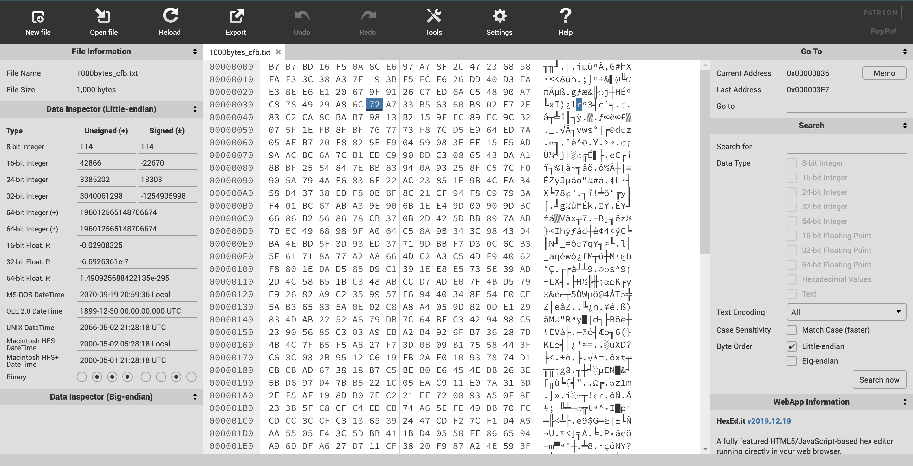
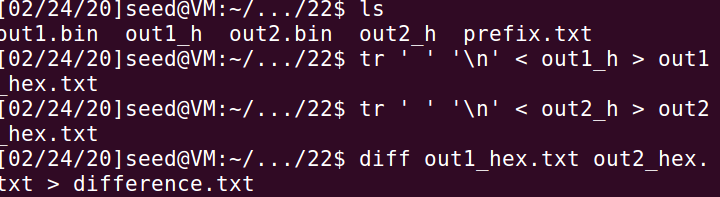
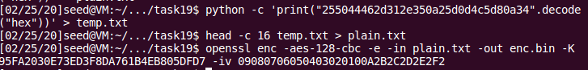

# Report of CS4293 Assignment 1

[TOC]

## Secret-Key Encryption

### Task 1:  Frequency Analysis Against Monoalphabetic Substitution Cipher

* Answer: 

  * The key of encryption is `vgapnbrtmosicuxejhqyzflkdw` corresponds to `abcdefghijklmnopqrstuvwxyz`

  * Plaintext: 

    ```
    the oscars turn  on sunday which seems about right after this long strange
    awards trip the bagger feels like a nonagenarian too
    
    the awards race was bookended by the demise of harvey weinstein at its outset
    and the apparent implosion of his film company at the end and it was shaped by
    the emergence of metoo times up blackgown politics armcandy activism and
    a national conversation as brief and mad as a fever dream about whether there
    ought to be a president winfrey the season didnt just seem extra long it was
    extra long because the oscars were moved to the first weekend in march to
    avoid conflicting with the closing ceremony of the winter olympics thanks
    pyeongchang
    
    one big question surrounding this years academy awards is how or if the
    ceremony will address metoo especially after the golden globes which became
    a jubilant comingout party for times up the movement spearheaded by 
    powerful hollywood women who helped raise millions of dollars to fight sexual
    harassment around the country
    
    signaling their support golden globes attendees swathed themselves in black
    sported lapel pins and sounded off about sexist power imbalances from the red
    carpet and the stage on the air e was called out about pay inequity after
    its former anchor catt sadler quit once she learned that she was making far
    less than a male cohost and during the ceremony natalie portman took a blunt
    and satisfying dig at the allmale roster of nominated directors how could
    that be topped
    
    as it turns out at least in terms of the oscars it probably wont be
    
    women involved in times up said that although the globes signified the
    initiatives launch they never intended it to be just an awards season
    campaign or one that became associated only with redcarpet actions instead
    a spokeswoman said the group is working behind closed doors and has since
    amassed  million for its legal defense fund which after the globes was
    flooded with thousands of donations of  or less from people in some 
    countries
    
    
    no call to wear black gowns went out in advance of the oscars though the
    movement will almost certainly be referenced before and during the ceremony 
    especially since vocal metoo supporters like ashley judd laura dern and
    nicole kidman are scheduled presenters
    
    another feature of this season no one really knows who is going to win best
    picture arguably this happens a lot of the time inarguably the nailbiter
    narrative only serves the awards hype machine but often the people forecasting
    the race socalled oscarologists can make only educated guesses
    
    the way the academy tabulates the big winner doesnt help in every other
    category the nominee with the most votes wins but in the best picture
    category voters are asked to list their top movies in preferential order if a
    movie gets more than  percent of the firstplace votes it wins when no
    movie manages that the one with the fewest firstplace votes is eliminated and
    its votes are redistributed to the movies that garnered the eliminated ballots
    secondplace votes and this continues until a winner emerges
    
    it is all terribly confusing but apparently the consensus favorite comes out
    ahead in the end this means that endofseason awards chatter invariably
    involves tortured speculation about which film would most likely be voters
    second or third favorite and then equally tortured conclusions about which
    film might prevail
    
    in  it was a tossup between boyhood and the eventual winner birdman
    in  with lots of experts betting on the revenant or the big short the
    prize went to spotlight last year nearly all the forecasters declared la
    la land the presumptive winner and for two and a half minutes they were
    correct before an envelope snafu was revealed and the rightful winner
    moonlight was crowned
    
    this year awards watchers are unequally divided between three billboards
    outside ebbing missouri the favorite and the shape of water which is
    the baggers prediction with a few forecasting a hail mary win for get out
    
    but all of those films have historical oscarvoting patterns against them the
    shape of water has  nominations more than any other film and was also
    named the years best by the producers and directors guilds yet it was not
    nominated for a screen actors guild award for best ensemble and no film has
    won best picture without previously landing at least the actors nomination
    since braveheart in  this year the best ensemble sag ended up going to
    three billboards which is significant because actors make up the academys
    largest branch that film while divisive also won the best drama golden globe
    and the bafta but its filmmaker martin mcdonagh was not nominated for best
    director and apart from argo movies that land best picture without also
    earning best director nominations are few and far between
    
    ```

* Explanation: I used the [online decrypting resource](<http://www.richkni.co.uk/php/crypta/freq.php>) to analyze the character frequency and compared it with the frequency [bigram](<https://en.wikipedia.org/wiki/Bigram>) and [trigram](<https://en.wikipedia.org/wiki/Trigram>). I also used the [word finder](<https://word.tips/>). By **selecting all the words with length two and three** and comparing the result, we can find that the most possible mapping is (`plain<=> cypher`): 

* Code (Select words with specific length): 

  ```python
  import operator
  with open('ciphertext.txt', 'r') as file:
  	words = file.read().split()
      dic = {}
      for word in words:
          if len(word) == 3:
              if not word in dic :
                  dic[word] = 1
              else:
                  dic[word] += 1
       sorted_dic = sorted(dic.items(), key=lambda kv:kv[1])
       print(sorted_dic)
  ```

* Observation:

  * Steps to find the key

  ```
  (1) the <=> ytn: 
  {e <=> n, h <=> t, t <=> y}
  (2) three <=> ythnn (guess): 
  {e <=> n, h <=> t, r <=> h, t <=> y}
  (3) that <=> ytvy :  
  {a <=> v, e <=> n, h <=> t, r <=> h, t <=> y}
  (4) to <=> yx :
  {a <=> v, e <=> n, h <=> t, o <=> x, r <=> h, t <=> y}
  (5) of <=> xb :
  {a <=> v, e <=> n, f <=> b, h <=> t, o <=> x, r <=> h, t <=> y}
  (6) it <=> my
  {a <=> v, e <=> n, f <=> b, h <=> t, i <=> m, o <=> x, r <=> h, t <=> y}
  (7) in <=> mu, on <=> xu, no <=> ux
  {a <=> v, e <=> n, f <=> b, h <=> t, i <=> m, n <=> u, o <=> x, r <=> h, t <=> y}
  (8) all <=> vii, which <=> ltmat, until a winner <=> zuymi v lmuunh
  {a <=> v, c <=> a, e <=> n, f <=> b, h <=> t, i <=> m, l <=> i, n <=> u, o <=> x, r <=> h, t <=> y, u <=> z, w <=> l}
  (9) is <=> mq
  {a <=> v, c <=> a, e <=> n, f <=> b, h <=> t, i <=> m, l <=> i, n <=> u, o <=> x, r <=> h, s <=> q, t <=> y, u <=> z, w <=> l}
  (10) about <=> vgxzy, seems <=> qnncq, right <=> hmrty
  {abcefghilmnorstuw <=> vganbrtmicuxhqyzl}
  (11) awards <=> vlvhpq, just <=> ozqy, like <=> imsn, trip <=> yhme, quit <=> jzmy, harvey <=> tvhfnd, extra <=> nkyhv, they <=> ytnd
  {abcdefghijklmnopqrstuvwxyz <=> vgapnbrtmosicuxejhqyzflkdw}
  ```

  * Words with length 2 and 3

  

  

  * Frequency

    * one character

      

    * two character

      

    * three character

      

-----------------------------

### Task 2: Encryption using Different Ciphers and Modes

* Observation

  * Use `s -aes-128-cbc`

    * command

    

    * encrypted binary file

    

    * decrypted file

    

  * Use `-bf-cbc`

    * command line

    

    * encrypted binary file

    

    * decrypted file

    

  * Use `-aes-128-cfb`

    * command

    

    * encrypted binary file

    

    * decrypted file

    

  * Use different algorithms to encode and decode

    * command line

    

    * decrypted file by using different algorithm => does not work (use wrong key to decrypt also doesn’t work)

    

--------------------------------

### Task 3: Encryption Mode - ECB vs. CBC

* Observation

  * Command line

    

  * Comparison between three pictures

    

* Explanation: ECB is basically raw cipher (i.e. same input and key will result into same cipher text) , while CBC is step-by-step cipher which takes the output of the previous cipher and performs XOR with a block of plaintext. The first output is produced by first plaintext block and initialization vector. Therefore, ECB will preserve some features of the original image, while CBC will not. 

* My picture: 

  

  * The results for `ecb` and `cbc` modes are both well encrypted. 
  * The reason might be for this picture, the colors are more complex. For `aes` encryption, a little change on input will result in a slightly change in the output. Therefore, for areas that looks the same, the encrypted value is slightly different because there are some little differences. 

------------------------------------

### Task 4: Padding

* Observation (for paddings, we can find repeat values at the end of the decrypt file)

  * ECB: Has padding

    

  * CBC: Has padding

    

  * CFB: No padding

    

  * OFB: No padding

    

  * `5-bytes`, `10-bytes`, and `16-bytes`: 

    

    

    * `5-bytes`, `10-bytes`, and `16-bytes` are decrypted to `16-bytes`, `16-bytes`, and `32-bytes` respectively. 
    * The padding values are `0x0b = 11 = 16 - 5`, `0x06 = 6 = 16 - 10`, `0x10 = 16 = 32 - 16` respectively

* Explanation: 

  * The block ciphers require specific block size. 

  * Once the plaintext is not dividable to equal-sized blocks, there will be exactly one smaller block, which will be the last block in the encryption pipeline. 

  * For modes CFB and OFB, the last block of plaintext will not be used by the block cipher (as shown below).

  * Besides, CFB and OFB modes borrow the idea from stream cipher, stream cipher does not require the length of the plaintext. 

    

    

------------------

### Task 5: Error Propagation – Corrupted Cipher Text

* Answer: The number of blocks corrupted in ECB, CBC, CFB, OFB are 1 block, 2 blocks, 2 blocks, and 1 block respectively. 

* Observation

  * Create: Use `generator.py`: 

    ```python
    with open("1000bytes.txt", "w") as file:
        for i in range(0, 1000):
            file.write(str(i%10))
    ```

    

  * Encrypt (Use ECB as an example)

    

  * Edit: I use [online bless](<https://hexed.it/?hl=en>) to simulate the data corruption: 

    

  * Decryption: Decryption:  

    * ECB: The result is the same as I expected, only one block is corrupted. Besides, all bytes in the corrupted block is corrupted. 

      

    * CBC: The result is the same as I expected, only two blocks are corrupted. Besides, **all bytes in the corrupted block is corrupted while only one byte in the next block is corrupted**

      

    * CFB: The result is the same as I expected, only two blocks are corrupted. Besides, **only one byte in the corrupted block is corrupted while all bytes in the next block is corrupted**

      

    * OFB: The result is the same as I expected, **only one block is corrupted.** 

      

* Explanation (red color represents error):

  * Notice that encryption function $E$ and decryption function $D$ makes sure **each bits of output are dependent to each bits of input**, while each bits of output of XOR is only dependent on two bits of two inputs respectively. 

  * ECB: Because only $\color{red}{P_i} = D_k(\color{red}{C_i})​$ depends on the error block. 

  * CBC: Because for CBC decryption
    $$
    \color{red}{P_i }= D_k(\color{red}{C_i})\oplus C_{i-1}, \color{red}{P_{i+1}} = D_k(C_{i+1})\oplus\color{red}{ C_{i}}
    $$

  * CFB: Because for CFB decryption
    $$
    \color{red}{P_i}= E_k({C_{i-1}})\oplus \color{red}{C_{i}}, \color{red}{P_{i+1}} = E_k(\color{red}{C_{i}})\oplus {C_{i+1}}
    $$

  * OFB: Because for CFB decruption
    $$
    \color{red}{P_i} = \color{red}{C_i} \oplus E_k^{(i+1)}(IV) \\
    E^{(i+1)}_k\ represents\ apply\ encryption\ for\ i+1\ times
    $$


-----------------------

### Task 6: Initial Vector (IV)

#### Task 6.1

* Observation: The same plaintext with same key and same IV results in same cipher text, while different IV results in different cipher text

  

* Explanation: Based on (2), IV should be unique to make sure the cipher text is different for two encryption with same plain text and key to avoid attacking such as linguistic analysis. 

#### Task 6.2

* Answer: P2 can be decrypted because:
  $$
  {C1} = {P1_0} \oplus E^{(0+1)}(key,IV)||{P1_1} \oplus E^{(1+1)}(key,IV)||...||{P1_n} \oplus E_k^{(n+1)}(IV) \\
  {C2} = {P2_0} \oplus E^{(0+1)}(key,IV)||{P2_1} \oplus E^{(1+1)}(key,IV)||...||{P2_n} \oplus E_k^{(n+1)}(IV) \\
  P1 \oplus C1 \oplus C2 = P2_0 || P2_1 || ... || P2_n = P2
  $$

*  Result: Order: Launch a missile!

* Code: 

  

* If we replace OFB with CFB: 
  $$
  C1 = E(key, IV) \oplus P1_0 || E(key, C1_0) \oplus P1_1 || ... || E(key, C1_{n-1}) \oplus P1_n \\
  C2 = E(key, IV) \oplus P2_0 || E(key, C2_0) \oplus P2_1 || ... || E(key, C1_{n-1}) \oplus P2_n \\
  P1_0\oplus C1_0 \oplus C2_0 \\
   = P1_0 \oplus E(key, IV) \oplus P1_0 \oplus E(key, IV) \oplus P2_0 = P2_0 \\
  $$

* Answer: $E(key, C1_0)$ and $E(key, C2_0)$ cannot be cancelled, therefore **only the first block can be easily revealed**. For following blocks, the encryption part cannot be cancelled. 

#### Task 6.3

* In this case, the message only contains one block: 
  $$
  C1 = E(key, P1 \oplus IV1) \\
  C2 = E(key, P2 \oplus IV2) \\
  $$

* To construct a message, we set:
  $$
  P1^\prime = "Yes" \\
  
  P2 = P1^\prime \oplus IV1 \oplus IV2 \\
  
  C2 = E(key, (P1^\prime \oplus IV1 \oplus IV2)\oplus IV2 ) \\
   = E(key, P1^\prime \oplus IV1)
  $$

* We know that for 1-block aes, the outputs of same inputs are the same, therefore we check whether $C2 = C1$, if the result is the same, $P1$ is $Yes$, otherwise $P1$ is $No$ 

* Code

  ```python
  def lxor(l1, l2):
  	return [i1 ^ i2 for (i1, i2) in zip(l1, l2)]
  
  p2 = list(bytes('Yes', 'ascii')) + [13] * 13
  iv1 = list(bytes.fromhex("31323334353637383930313233343536"))
  iv2 = list(bytes.fromhex("31323334353637383930313233343537"))
  with open("plain.txt", 'wb') as f:
  	f.write(bytes(lxor(lxor(p2, iv1), iv2)))
  ```

* Result: We can find that the result of `c2` is the same as `c1`, which means that `p1` is **Yes**

  

--------------------

### Task 7: Programming using the Crypto Library

* Code: `myenv.cpp`

  ```cpp
  #include <openssl/evp.h>
  #include <string.h>
  #include <stdio.h>
  #define ENCRYPT 1
  #define DECRYPT 0
  
  unsigned char* do_crypt( unsigned char* intext, unsigned char* key, 
                           unsigned char* iv, int do_encrypt
  ){
     unsigned char* ans = (unsigned char*) malloc(1024) ;
     memset(ans, 0, 1024);
     unsigned char outbuf[1024];
     int outlen, tmplen;
  
     EVP_CIPHER_CTX ctx;
     /* Don't set key or IV right away; we want to check lengths */
     EVP_CIPHER_CTX_init(&ctx);
     EVP_CipherInit_ex(&ctx, EVP_aes_128_cbc(), NULL, NULL, NULL,
             do_encrypt);
     OPENSSL_assert(EVP_CIPHER_CTX_key_length(&ctx) == 16);
     OPENSSL_assert(EVP_CIPHER_CTX_iv_length(&ctx) == 16);
     /* Now we can set key and IV */
     EVP_CipherInit_ex(&ctx, NULL, NULL, key, iv, do_encrypt);
  
    if(!EVP_EncryptUpdate(&ctx, outbuf, &outlen, intext, 32)){
      /* Error */
      return 0;
    }
    if(!EVP_EncryptFinal_ex(&ctx, outbuf + outlen, &tmplen)){
      /* Error */
      return 0;
    }
    outlen += tmplen;
    EVP_CIPHER_CTX_cleanup(&ctx);
    memcpy(ans, outbuf, outlen);
    return ans;
  }
  
  int hex_to_int(char c){
    if(c<='9'&&c>='0'){
      return c-'0' + 0;
    } else {
      return c-'a' + 10;
    }
  }
  
  int hex_to_ascii(char c, char d){
    int high = hex_to_int(c) * 16;
    int low = hex_to_int(d);
    return high+low;
  }
  
  int main(){
    FILE* word_list = fopen("./assignment1-words.txt", "rb");
  
    // Convert hex cipher text into string
    unsigned char ciphertext[32];
    const char* tmp 
    = "764aa26b55a4da654df6b19e4bce00f4ed05e09346fb0e762583cb7da2ac93a2";
    int length = strlen(tmp);
    char buf = 0;
    for(int i = 0; i < length; i++){
      if(i % 2 != 0){
        ciphertext[i/2] = hex_to_ascii(buf, tmp[i]);
      }else{
        buf = tmp[i];
      }
    }
  
    unsigned char iv[16];
    const char* tmp2 = "aabbccddeeff00998877665544332211";
    length = strlen(tmp2);
    buf = 0;
    for(int i = 0; i < length; i++){ 
      if(i % 2 != 0){
        iv[i/2] = hex_to_ascii(buf, tmp2[i]);
      }else{
        buf = tmp2[i];
      }
    }
  
    size_t len = 0;
    char* line = (char*)malloc(1024);
    ssize_t read;
    int word_i = 0;
    while ((read = getline(&line, &len, word_list)) != -1) {
        unsigned char key[17];
        char key2[17];
        for(int i=0;i<16;i++){
          if(i<(int)(read)-1){
            key2[i] = key[i] = line[i];
          } else {
            key2[i] = key[i] = '#';
          }
        }
        key2[16] = key[16] = 0;       
        unsigned char* ans = do_crypt(ciphertext, key, iv, DECRYPT);
        if(ans){
          char check_ans[22];
          for(int i=0; i< 21;i++){
            check_ans[i] = ans[i];
          }      
          check_ans[21] = 0;
          if(strcmp(check_ans, "This is a top secret.") == 0){
            printf("%s\n", key2);
          }
        } 
    }
    return 0;
  }
  
  ```

* Answer: key: `Syracuse########` 

  

---------------------------------

## MD5 Collision Attack

### Task 8: Generating Two Different Files with the Same MD5 Hash

* Command line: 

  

  

* Result (The difference between `out1.bin` and `out2.bin` in hex format): 

  * Prefix length 21 bytes

    ```
    84c84
    < 8B
    ---
    > 0B
    110,111c110,111
    < B8
    < 22
    ---
    > 38
    > 23
    124c124
    < 52
    ---
    > D2
    148c148
    < 16
    ---
    > 96
    174,175c174,175
    < 74
    < 06
    ---
    > F4
    > 05
    188c188
    < 24
    ---
    > A4
    ```

  * Prefix length 22 bytes

    ```
    84c84
    < 24
    ---
    > A4
    110c110
    < 7C
    ---
    > FC
    124c124
    < 4A
    ---
    > CA
    148c148
    < 31
    ---
    > B1
    174c174
    < E0
    ---
    > 60
    188c188
    < 1D
    ---
    > 9D
    ```

  * Prefix length 64 bytes

    ```
    84c84
    < 37
    ---
    > B7
    110,111c110,111
    < D1
    < 97
    ---
    > 51
    > 98
    124c124
    < 68
    ---
    > E8
    148c148
    < 3C
    ---
    > BC
    174,175c174,175
    < 40
    < F1
    ---
    > C0
    > F0
    188c188
    < 26
    ---
    > A6
    ```

  * Prefix length 128 bytes

    ```
    148c148
    < 63
    ---
    > E3
    174,175c174,175
    < 97
    < AC
    ---
    > 17
    > AD
    188c188
    < 96
    ---
    > 16
    212c212
    < 2A
    ---
    > AA
    238c238
    < 94
    ---
    > 14
    252c252
    < 42
    ---
    > C2
    ```

* Observations: 

  * For all the cases the `md5sum` of generated two files are the same. 
  * **Most of the bytes are the same, most of the different bytes between two files for different prefix are the same**
  * **If the x-th byte is different, then (x+64)-th byte is also different** 
  * Changed bits might be selected from a small set of bits

* Answer: 

  * Question 1: `md5sum` of generated two files are the same. There are some zero paddings for the prefix, to make sure the prefix length is a multiple of 64

    

  * Question 2: `md5sum` of generated two files are the same. There is no padding

    

  * Question 3: Most of the bytes are the same， most of the different bytes between two files for different prefix are the same, the most frequent different bytes for all the cases in 128 bytes are `20, 46, 60, 84=20+64, 110=46+64, 124=60+64` , but for different length of prefix, the different bytes might be different. 

-----------------

### Task 9: Understanding MD5’s Property

* Experiment: 

  * `out1.bin, out2.bin` are generated by using same method in Task 8

  * The hash values are the same if we concat same value to `out1.bin` and `out2.bin`

    

-----------------

### Task 10: Generating Two Executable Files with the Same MD5 Hash 

* Set up: 

  * Code for `p1.c`:

    ```c
    #include <stdio.h>
    unsigned char xyz[200] = {
    /* The actual contents of this array are up to you */
    	0x41, 0x41, 0x41, 0x41, 0x41, 0x41, 0x41, 0x41, 0x41, 0x41,
    	0x41, 0x41, 0x41, 0x41, 0x41, 0x41, 0x41, 0x41, 0x41, 0x41,
    	0x41, 0x41, 0x41, 0x41, 0x41, 0x41, 0x41, 0x41, 0x41, 0x41,
    	0x41, 0x41, 0x41, 0x41, 0x41, 0x41, 0x41, 0x41, 0x41, 0x41,
    	0x41, 0x41, 0x41, 0x41, 0x41, 0x41, 0x41, 0x41, 0x41, 0x41,
    	0x41, 0x41, 0x41, 0x41, 0x41, 0x41, 0x41, 0x41, 0x41, 0x41,
    	0x41, 0x41, 0x41, 0x41, 0x41, 0x41, 0x41, 0x41, 0x41, 0x41,
    	0x41, 0x41, 0x41, 0x41, 0x41, 0x41, 0x41, 0x41, 0x41, 0x41,
    	0x41, 0x41, 0x41, 0x41, 0x41, 0x41, 0x41, 0x41, 0x41, 0x41,
    	0x41, 0x41, 0x41, 0x41, 0x41, 0x41, 0x41, 0x41, 0x41, 0x41,
    	0x41, 0x41, 0x41, 0x41, 0x41, 0x41, 0x41, 0x41, 0x41, 0x41,
    	0x41, 0x41, 0x41, 0x41, 0x41, 0x41, 0x41, 0x41, 0x41, 0x41,
    	0x41, 0x41, 0x41, 0x41, 0x41, 0x41, 0x41, 0x41, 0x41, 0x41,
    	0x41, 0x41, 0x41, 0x41, 0x41, 0x41, 0x41, 0x41, 0x41, 0x41,
    	0x41, 0x41, 0x41, 0x41, 0x41, 0x41, 0x41, 0x41, 0x41, 0x41,
    	0x41, 0x41, 0x41, 0x41, 0x41, 0x41, 0x41, 0x41, 0x41, 0x41,
    	0x41, 0x41, 0x41, 0x41, 0x41, 0x41, 0x41, 0x41, 0x41, 0x41,
    	0x41, 0x41, 0x41, 0x41, 0x41, 0x41, 0x41, 0x41, 0x41, 0x41,
    	0x41, 0x41, 0x41, 0x41, 0x41, 0x41, 0x41, 0x41, 0x41, 0x41,
    	0x41, 0x41, 0x41, 0x41, 0x41, 0x41, 0x41, 0x41, 0x41, 0x41,
    };
    int main()
    {
    	int i;	
    	for (i=0; i<200; i++){
    		printf("%x", xyz[i]);
    	}
    	printf("\n");
    }
    ```

  * Find the position of the array is the 4161-th byte

    

  * $4161\ mod\ 64=1​$, it is the first bit of the block

  * prefix: $4160$ bytes, suffix $7636(total)-4160-200 = 3276$ bytes

  * Get prefix and suffix, and use `md5collgen` to generate prefix of two programs:

    

  * Obtain the final values according to the property:  $MD5(Prefix|P|Suffix)= MD5(Prefix|Q|Suffix) $ 

    

  * Check the correctness

    

-------------------

### Task 11: Making the Two Programs Behave Differently

* Code for `p1.c`: 

  ```c
  #include <stdio.h>
  unsigned char a[200] = {
  /* The actual contents of this array are up to you */
  	0x41, 0x41, 0x41, 0x41, 0x41, 0x41, 0x41, 0x41, 0x41, 0x41,
  	0x41, 0x41, 0x41, 0x41, 0x41, 0x41, 0x41, 0x41, 0x41, 0x41,
  	0x41, 0x41, 0x41, 0x41, 0x41, 0x41, 0x41, 0x41, 0x41, 0x41,
  	0x41, 0x41, 0x41, 0x41, 0x41, 0x41, 0x41, 0x41, 0x41, 0x41,
  	0x41, 0x41, 0x41, 0x41, 0x41, 0x41, 0x41, 0x41, 0x41, 0x41,
  	0x41, 0x41, 0x41, 0x41, 0x41, 0x41, 0x41, 0x41, 0x41, 0x41,
  	0x41, 0x41, 0x41, 0x41, 0x41, 0x41, 0x41, 0x41, 0x41, 0x41,
  	0x41, 0x41, 0x41, 0x41, 0x41, 0x41, 0x41, 0x41, 0x41, 0x41,
  	0x41, 0x41, 0x41, 0x41, 0x41, 0x41, 0x41, 0x41, 0x41, 0x41,
  	0x41, 0x41, 0x41, 0x41, 0x41, 0x41, 0x41, 0x41, 0x41, 0x41,
  	0x41, 0x41, 0x41, 0x41, 0x41, 0x41, 0x41, 0x41, 0x41, 0x41,
  	0x41, 0x41, 0x41, 0x41, 0x41, 0x41, 0x41, 0x41, 0x41, 0x41,
  	0x41, 0x41, 0x41, 0x41, 0x41, 0x41, 0x41, 0x41, 0x41, 0x41,
  	0x41, 0x41, 0x41, 0x41, 0x41, 0x41, 0x41, 0x41, 0x41, 0x41,
  	0x41, 0x41, 0x41, 0x41, 0x41, 0x41, 0x41, 0x41, 0x41, 0x41,
  	0x41, 0x41, 0x41, 0x41, 0x41, 0x41, 0x41, 0x41, 0x41, 0x41,
  	0x41, 0x41, 0x41, 0x41, 0x41, 0x41, 0x41, 0x41, 0x41, 0x41,
  	0x41, 0x41, 0x41, 0x41, 0x41, 0x41, 0x41, 0x41, 0x41, 0x41,
  	0x41, 0x41, 0x41, 0x41, 0x41, 0x41, 0x41, 0x41, 0x41, 0x41,
  	0x41, 0x41, 0x41, 0x41, 0x41, 0x41, 0x41, 0x41, 0x41, 0x41,
  };
  unsigned char b[200] = {
  /* The actual contents of this array are up to you */
  	0x41, 0x41, 0x41, 0x41, 0x41, 0x41, 0x41, 0x41, 0x41, 0x41,
  	0x41, 0x41, 0x41, 0x41, 0x41, 0x41, 0x41, 0x41, 0x41, 0x41,
  	0x41, 0x41, 0x41, 0x41, 0x41, 0x41, 0x41, 0x41, 0x41, 0x41,
  	0x41, 0x41, 0x41, 0x41, 0x41, 0x41, 0x41, 0x41, 0x41, 0x41,
  	0x41, 0x41, 0x41, 0x41, 0x41, 0x41, 0x41, 0x41, 0x41, 0x41,
  	0x41, 0x41, 0x41, 0x41, 0x41, 0x41, 0x41, 0x41, 0x41, 0x41,
  	0x41, 0x41, 0x41, 0x41, 0x41, 0x41, 0x41, 0x41, 0x41, 0x41,
  	0x41, 0x41, 0x41, 0x41, 0x41, 0x41, 0x41, 0x41, 0x41, 0x41,
  	0x41, 0x41, 0x41, 0x41, 0x41, 0x41, 0x41, 0x41, 0x41, 0x41,
  	0x41, 0x41, 0x41, 0x41, 0x41, 0x41, 0x41, 0x41, 0x41, 0x41,
  	0x41, 0x41, 0x41, 0x41, 0x41, 0x41, 0x41, 0x41, 0x41, 0x41,
  	0x41, 0x41, 0x41, 0x41, 0x41, 0x41, 0x41, 0x41, 0x41, 0x41,
  	0x41, 0x41, 0x41, 0x41, 0x41, 0x41, 0x41, 0x41, 0x41, 0x41,
  	0x41, 0x41, 0x41, 0x41, 0x41, 0x41, 0x41, 0x41, 0x41, 0x41,
  	0x41, 0x41, 0x41, 0x41, 0x41, 0x41, 0x41, 0x41, 0x41, 0x41,
  	0x41, 0x41, 0x41, 0x41, 0x41, 0x41, 0x41, 0x41, 0x41, 0x41,
  	0x41, 0x41, 0x41, 0x41, 0x41, 0x41, 0x41, 0x41, 0x41, 0x41,
  	0x41, 0x41, 0x41, 0x41, 0x41, 0x41, 0x41, 0x41, 0x41, 0x41,
  	0x41, 0x41, 0x41, 0x41, 0x41, 0x41, 0x41, 0x41, 0x41, 0x41,
  	0x41, 0x41, 0x41, 0x41, 0x41, 0x41, 0x41, 0x41, 0x41, 0x41,
  };
  int main()
  {
  	int i;	
  	int same = 1;
  	for (i=0; i<200; i++){
  		if(a[i] != b[i]){
  			same = 0;
  			break;
  		}
  	}
  	if(same){
  		printf("Do benign things.\n");
  	} else {
  		printf("Do malicious things.\n");
  	}
  	printf("\n");
  }
  ```

* Prefix: 4160, Total: 7872, Prefix+128+middle: 4384, Suffix: 3359

  

* Divide and generate collision: 

  

* Get `p` after generation and connect the values together: 

  

* Check the result

  

-----------------

## RSA Public-Key Encryption and Signature

### Task 12: Deriving the Private Key

* Code:

  ```c
  #include <stdio.h>
  #include <openssl/bn.h>
  #define NBITS 256
  void printBN(char *msg, BIGNUM * a)
  {
  	/* Use BN_bn2hex(a) for hex string
  	* Use BN_bn2dec(a) for decimal string */
  	char * number_str = BN_bn2hex(a);
  	printf("%s %s\n", msg, number_str);
  	OPENSSL_free(number_str);
  }
  
  int main ()
  {
  	BN_CTX *ctx = BN_CTX_new();
  	BIGNUM *p = BN_new();
  	BIGNUM *q = BN_new();
  	BIGNUM *one = BN_new();
  	BIGNUM *phi_p = BN_new();
  	BIGNUM *phi_q = BN_new();
  	BIGNUM *phi_n = BN_new();
  	BIGNUM *e = BN_new();
  	BIGNUM *res = BN_new();
  
  	// Initialization
  	BN_hex2bn(&p, "F7E75FDC469067FFDC4E847C51F452DF");
  	BN_hex2bn(&q, "E85CED54AF57E53E092113E62F436F4F");
  	BN_hex2bn(&one, "1");
  	BN_hex2bn(&e, "0D88C3");
  
  	// Calculate phi
  	BN_sub(phi_p, p, one);
  	BN_sub(phi_q, q, one);
  	BN_mul(phi_n, phi_p, phi_q, ctx);
  
  	// res = e^{-1} (mod phi_n)
  	BN_mod_inverse(res, e, phi_n, ctx);
  	printBN("e  = e^{-1} (mod phi_n) = ", res);
  	return 0;
  }
  ```

  

* Result: $d \equiv e^{-1}(mod\ \phi(pq)) = $`(0X)3587A24598E5F2A21DB007D89D18CC50ABA5075BA19A33890FE7C28A9B496AEB` 

----------------

### Task 13: Encrypting a Message

* Code: 

  ```cpp
  #include <stdio.h>
  #include <openssl/bn.h>
  #define NBITS 256
  void printBN(char *msg, BIGNUM * a)
  {
  	/* Use BN_bn2hex(a) for hex string
  	* Use BN_bn2dec(a) for decimal string */
  	char * number_str = BN_bn2hex(a);
  	printf("%s %s\n", msg, number_str);
  	OPENSSL_free(number_str);
  }
  
  int main ()
  {
  	BN_CTX *ctx = BN_CTX_new();
  	BIGNUM *n = BN_new();
  	BIGNUM *e = BN_new();
  	BIGNUM *M = BN_new();
  	BIGNUM *d = BN_new();
  	BIGNUM *C = BN_new();
  	BIGNUM *M_prime = BN_new();
  
  	// Initialization
  	BN_hex2bn(&n, "DCBFFE3E51F62E09CE7032E2677A78946A849DC4CDDE3A4D0CB81629242FB1A5");
  	BN_hex2bn(&e, "010001");
  	BN_hex2bn(&M, "4120746f702073656372657421");
  	BN_hex2bn(&d, "74D806F9F3A62BAE331FFE3F0A68AFE35B3D2E4794148AACBC26AA381CD7D30D");
  
  	// C = M^e mod n
  	BN_mod_exp(C, M, e, n, ctx);
  	printBN("Encrypted M^e mod n = ", C);
  	BN_mod_exp(M_prime, C, d, n, ctx);
  	printBN("Decrypted C^d mod n = ", M_prime);
  	return 0;
  }
  
  ```

  

* Result: $C = M^e\ mod\ n =$

  `(0x)6FB078DA550B2650832661E14F4F8D2CFAEF475A0DF3A75CACDC5DE5CFC5FADC`

------------------

### Task 14: Decrypting a Message

* Code

  ```cpp
  #include <stdio.h>
  #include <openssl/bn.h>
  #define NBITS 256
  void printBN(char *msg, BIGNUM * a)
  {
  	/* Use BN_bn2hex(a) for hex string
  	* Use BN_bn2dec(a) for decimal string */
  	char * number_str = BN_bn2hex(a);
  	printf("%s %s\n", msg, number_str);
  	OPENSSL_free(number_str);
  }
  
  int main ()
  {
  	BN_CTX *ctx = BN_CTX_new();
  	BIGNUM *n = BN_new();
  	BIGNUM *d = BN_new();
  	BIGNUM *C = BN_new();
  	BIGNUM *M_prime = BN_new();
  
  	// Initialization
  	BN_hex2bn(&n, "DCBFFE3E51F62E09CE7032E2677A78946A849DC4CDDE3A4D0CB81629242FB1A5");
  	BN_hex2bn(&d, "74D806F9F3A62BAE331FFE3F0A68AFE35B3D2E4794148AACBC26AA381CD7D30D");
  	BN_hex2bn(&C, "8C0F971DF2F3672B28811407E2DABBE1DA0FEBBBDFC7DCB67396567EA1E2493F");
  
  	// M = C^d mod n
  	BN_mod_exp(M_prime, C, d, n, ctx);
  	printBN("Decrypted C^d mod n = ", M_prime);
  	return 0;
  }
  
  ```

  

* Result: $M^\prime = C^d\ mod\ n =$

  `Password is dees`

---------------

### Task 15: Signing a Message

* Find out the hex value of message: 

  

  

* Code

  ```cpp
  #include <stdio.h>
  #include <openssl/bn.h>
  #define NBITS 256
  void printBN(char *msg, BIGNUM * a)
  {
  	/* Use BN_bn2hex(a) for hex string
  	* Use BN_bn2dec(a) for decimal string */
  	char * number_str = BN_bn2hex(a);
  	printf("%s %s\n", msg, number_str);
  	OPENSSL_free(number_str);
  }
  
  int main ()
  {
  	BN_CTX *ctx = BN_CTX_new();
  	BIGNUM *n = BN_new();
  	BIGNUM *d = BN_new();
  	BIGNUM *M = BN_new();
  	BIGNUM *S = BN_new();
  
  	// Initialization
  	BN_hex2bn(&n, "DCBFFE3E51F62E09CE7032E2677A78946A849DC4CDDE3A4D0CB81629242FB1A5");
  	BN_hex2bn(&d, "74D806F9F3A62BAE331FFE3F0A68AFE35B3D2E4794148AACBC26AA381CD7D30D");
  	BN_hex2bn(&M, "49206f776520796f752024323030302e");
      // BN_hex2bn(&M, "49206f776520796f752024313030302e");
  
  	// S = M^d mod n
  	BN_mod_exp(S, M, d, n, ctx);
  	printBN("Signed M^d mod n = ", S);
  	return 0;
  }
  
  ```

  * Message: “I owe you $2000.”

  

  * Message: “I owe you $1000.”

  

* Result: 

  * For “I owe you $2000.”, the signed value is `(0x)55A4E7F17F04CCFE2766E1EB32ADDBA890BBE92A6FBE2D785ED6E73CCB35E4CB`
  * For “I owe you $1000.”, the signed value is `(0x)2E53601F1C0FADAFC8C29C8C60C9A888F77A7820CEAF09C81762270805E1779E`
  * Observation: Change the message by a little bits will result in a slightly change in signed message

------------------

### Task 16: Verifying a Message

* Code

  ```cpp
  #include <stdio.h>
  #include <openssl/bn.h>
  #define NBITS 256
  void printBN(char *msg, BIGNUM * a)
  {
  	/* Use BN_bn2hex(a) for hex string
  	* Use BN_bn2dec(a) for decimal string */
  	char * number_str = BN_bn2hex(a);
  	printf("%s %s\n", msg, number_str);
  	OPENSSL_free(number_str);
  }
  
  int main ()
  {
  	BN_CTX *ctx = BN_CTX_new();
  	BIGNUM *n = BN_new();
  	BIGNUM *e = BN_new();
  	BIGNUM *S = BN_new();
  	BIGNUM *d = BN_new();
  	BIGNUM *M = BN_new();
  
  	// Initialization
  	BN_hex2bn(&n, "AE1CD4DC432798D933779FBD46C6E1247F0CF1233595113AA51B450F18116115");
  	BN_hex2bn(&e, "010001");
  	BN_hex2bn(&S, "643D6F34902D9C7EC90CB0B2BCA36C47FA37165C0005CAB026C0542CBDB6802F");
  	// BN_hex2bn(&S, "643D6F34902D9C7EC90CB0B2BCA36C47FA37165C0005CAB026C0542CBDB6803F");
  
  	// M = S^e mod n
  	BN_mod_exp(M, S, e, n, ctx);
  	printBN("Verified S^e mod n = ", M);
  	return 0;
  }
  
  ```

  

* Result: The signature is indeed Alice’s. 

* **Observation of changing `2F` to `3F`**

  

  * Verification failed, the result of verification is slightly different, as shown above. 

-------------------

### Task 17: Manually Verifying an X.509 Certificate

#### Step 1: Download a certificate from a real web server

* `c0.pem` for `s:/C=US/ST=New York/L=New York/jurisdictionC=US/jurisdictionST=Delaware/O=JPMorgan Chase and Co./businessCategory=Private Organization/serialNumber=691011/CN=www.chase.com`

  ```
  -----BEGIN CERTIFICATE-----
  MIIHJzCCBg+gAwIBAgIRAP17UFHwC61uAAAAAFTPlwgwDQYJKoZIhvcNAQELBQAw
  gboxCzAJBgNVBAYTAlVTMRYwFAYDVQQKEw1FbnRydXN0LCBJbmMuMSgwJgYDVQQL
  Ex9TZWUgd3d3LmVudHJ1c3QubmV0L2xlZ2FsLXRlcm1zMTkwNwYDVQQLEzAoYykg
  MjAxNCBFbnRydXN0LCBJbmMuIC0gZm9yIGF1dGhvcml6ZWQgdXNlIG9ubHkxLjAs
  BgNVBAMTJUVudHJ1c3QgQ2VydGlmaWNhdGlvbiBBdXRob3JpdHkgLSBMMU0wHhcN
  MTkwMzIxMTIxNzM1WhcNMjAwMzIxMTI0NzM1WjCBzDELMAkGA1UEBhMCVVMxETAP
  BgNVBAgTCE5ldyBZb3JrMREwDwYDVQQHEwhOZXcgWW9yazETMBEGCysGAQQBgjc8
  AgEDEwJVUzEZMBcGCysGAQQBgjc8AgECEwhEZWxhd2FyZTEfMB0GA1UEChMWSlBN
  b3JnYW4gQ2hhc2UgYW5kIENvLjEdMBsGA1UEDxMUUHJpdmF0ZSBPcmdhbml6YXRp
  b24xDzANBgNVBAUTBjY5MTAxMTEWMBQGA1UEAxMNd3d3LmNoYXNlLmNvbTCCASIw
  DQYJKoZIhvcNAQEBBQADggEPADCCAQoCggEBALwRpXHSWD/7DRjYIUdrxFCPC9Cu
  JRAvx2m7g1YeAWuTcLkwKnCr3h3g4sUk7K6umsYI9TpZ/6nnAvSR7dM214fZfvRO
  2Ees85bWb6Kb91mTce7PLd+c15/gqloiOwPvLY0VmQhb0KEkrEdLB7M9VoFFlkjE
  OlRUqwW584oOcXLLwBiq+4GVG2rfW/DQYEzXrMCXOIH0/Bg0Z0LWVxI3VZhZUb/h
  27kUYuvJ1LhfUnrRVzlYFTJchRTgIu7/Pepgo/VR4zUKhFHBd6lzspUefuvm5+cg
  311d1sSi2i19knqZH2FRpKgX+HIRcXhl4u38P9RrWMLfiHhAKxQ2QTxFlkUCAwEA
  AaOCAxIwggMOMCMGA1UdEQQcMBqCDXd3dy5jaGFzZS5jb22CCWNoYXNlLmNvbTCC
  AYAGCisGAQQB1nkCBAIEggFwBIIBbAFqAHcAh3W/51l8+IxDmV+9827/Vo1HVjb/
  SrVgwbTq/16ggw8AAAFpoErmiQAABAMASDBGAiEA92Nzh26VQrAroBgqKyxlVE5z
  g1BiUK6Agv2kBOzVFWwCIQC/w/4Qor5bhmtbzF4+lqATga5pSMvJd6xtFZjk8T+3
  lAB2AFWB1MIWkDYBSuoLm1c8U/DA5Dh4cCUIFy+jqh0HE9MMAAABaaBK5qEAAAQD
  AEcwRQIgSBx1k77ZaNbSY7I7gHHrnVXDrhH8r+YJx5SxDwVKIMUCIQCC3QbN8txE
  uYfgtDY1TEBNWJx/I4Sl1Fu1LW8JBwF8kAB3AKS5CZC0GFgUh7sTosxncAo8NZgE
  +RvfuON3zQ7IDdwQAAABaaBK5sUAAAQDAEgwRgIhAOPadj3LVWHyfrf0eyEQTOmW
  vj09Kv6yP6mPpvAMjociAiEA4G3dadfWQuDK33oAtgAAqr2aJvdu9AnggYzbK3R9
  BH0wDgYDVR0PAQH/BAQDAgWgMB0GA1UdJQQWMBQGCCsGAQUFBwMBBggrBgEFBQcD
  AjBoBggrBgEFBQcBAQRcMFowIwYIKwYBBQUHMAGGF2h0dHA6Ly9vY3NwLmVudHJ1
  c3QubmV0MDMGCCsGAQUFBzAChidodHRwOi8vYWlhLmVudHJ1c3QubmV0L2wxbS1j
  aGFpbjI1Ni5jZXIwMwYDVR0fBCwwKjAooCagJIYiaHR0cDovL2NybC5lbnRydXN0
  Lm5ldC9sZXZlbDFtLmNybDBKBgNVHSAEQzBBMDYGCmCGSAGG+mwKAQIwKDAmBggr
  BgEFBQcCARYaaHR0cDovL3d3dy5lbnRydXN0Lm5ldC9ycGEwBwYFZ4EMAQEwHwYD
  VR0jBBgwFoAUw/fQtSowra8NkSFwOVTdvIlwxzowHQYDVR0OBBYEFI7m5CNIAKzi
  e5uM+AzD7Mw4IlqpMAkGA1UdEwQCMAAwDQYJKoZIhvcNAQELBQADggEBAGRWzWCX
  nrDVF0kBt/uxdvRCpPWY7FpyU/eoDr3Gr9UI2SdqOhaUOmOjXIPWqpFOJSqUo/qf
  qTSDWshlvDBLgpheQ86jiqqwBCpHCBbeE82rSzWnfqWNsVUv1L3VMGtcYEN1uupl
  qUbLK+Bz3NnOa22BdLsk9qfP3OQioiNVFkE3h9glEAtKbDzF2pAXnWGjdVDtjeON
  HtJzQ1W6wz9LA84zJQYL3CUdDho09blaYELR9Dacprw7yEv/0D21rpNqevQFXVaC
  h97ob82ixMdXoFnl3fyGpKBcsR4r99GB7VwnXw+EvrIie6XKNX36kTOip4b6hh0E
  FgSm4nQgdn2fCM4=
  -----END CERTIFICATE-----
  ```

* `c1.pem` for `s:/C=US/O=Entrust, Inc./OU=See www.entrust.net/legal-terms/OU=(c) 2014 Entrust, Inc. - for authorized use only/CN=Entrust Certification Authority - L1M`

  ```
  -----BEGIN CERTIFICATE-----
  MIIFLTCCBBWgAwIBAgIMYaHn0gAAAABR02amMA0GCSqGSIb3DQEBCwUAMIG+MQsw
  CQYDVQQGEwJVUzEWMBQGA1UEChMNRW50cnVzdCwgSW5jLjEoMCYGA1UECxMfU2Vl
  IHd3dy5lbnRydXN0Lm5ldC9sZWdhbC10ZXJtczE5MDcGA1UECxMwKGMpIDIwMDkg
  RW50cnVzdCwgSW5jLiAtIGZvciBhdXRob3JpemVkIHVzZSBvbmx5MTIwMAYDVQQD
  EylFbnRydXN0IFJvb3QgQ2VydGlmaWNhdGlvbiBBdXRob3JpdHkgLSBHMjAeFw0x
  NDEyMTUxNTI1MDNaFw0zMDEwMTUxNTU1MDNaMIG6MQswCQYDVQQGEwJVUzEWMBQG
  A1UEChMNRW50cnVzdCwgSW5jLjEoMCYGA1UECxMfU2VlIHd3dy5lbnRydXN0Lm5l
  dC9sZWdhbC10ZXJtczE5MDcGA1UECxMwKGMpIDIwMTQgRW50cnVzdCwgSW5jLiAt
  IGZvciBhdXRob3JpemVkIHVzZSBvbmx5MS4wLAYDVQQDEyVFbnRydXN0IENlcnRp
  ZmljYXRpb24gQXV0aG9yaXR5IC0gTDFNMIIBIjANBgkqhkiG9w0BAQEFAAOCAQ8A
  MIIBCgKCAQEA0IHBOSPCsdHs91fdVSQ2kSAiSPf8ylIKsKs/M7WwhAf23056sPuY
  Ij0BrFb7cW2y7rmgD1J3q5iTvjOK64dex6qwymmPQwhqPyK/MzlG1ZTy4kwFItln
  gJHxBEoOm3yiydJs/TwJhL39axSagR3nioPvYRZ1R5gTOw2QFpi/iuInMlOZmcP7
  lhw192LtjL1JcdJDQ6Gh4yEqI3CodT2ybEYGYW8YZ+QpfrI8wcVfCR5uRE7sIZlY
  FUj0VUgqtzS0BeN8SYwAWN46lsw53GEzVc4qLj/RmWLoquY0djGqr3kplnjLgRSv
  adr7BLlZg0SqCU+01CwBnZuUMWstoc/B5QIDAQABo4IBKzCCAScwDgYDVR0PAQH/
  BAQDAgEGMB0GA1UdJQQWMBQGCCsGAQUFBwMCBggrBgEFBQcDATASBgNVHRMBAf8E
  CDAGAQH/AgEAMDMGCCsGAQUFBwEBBCcwJTAjBggrBgEFBQcwAYYXaHR0cDovL29j
  c3AuZW50cnVzdC5uZXQwMAYDVR0fBCkwJzAloCOgIYYfaHR0cDovL2NybC5lbnRy
  dXN0Lm5ldC9nMmNhLmNybDA7BgNVHSAENDAyMDAGBFUdIAAwKDAmBggrBgEFBQcC
  ARYaaHR0cDovL3d3dy5lbnRydXN0Lm5ldC9ycGEwHQYDVR0OBBYEFMP30LUqMK2v
  DZEhcDlU3byJcMc6MB8GA1UdIwQYMBaAFGpyJnrQHu995ztpUdRsjZ+QEmarMA0G
  CSqGSIb3DQEBCwUAA4IBAQC0h8eEIhopwKR47PVPG7SEl2937tTPWa+oQ5YvHVje
  pvMVWy7ZQ5xMQrkXFxGttLFBx2YMIoYFp7Qi+8VoaIqIMthx1hGOjlJ+Qgld2dnA
  DizvRGsf2yS89byxqsGK5Wbb0CTz34mmi/5e0FC6m3UAyQhKS3Q/WFOv9rihbISY
  Jnz8/DVRZZgeO2x28JkPxLkJ1YXYJKd/KsLak0tkuHB8VCnTglTVz6WUwzOeTTRn
  4Dh2ZgCN0C/GqwmqcvrOLzWJ/MDtBgO334wlV/H77yiI2YIowAQPlIFpI+CRKMVe
  1QzX1CA778n4wI+nQc1XRG5sZ2L+hN/nYNjvv9QiHg3n
  -----END CERTIFICATE-----
  
  ```

* `c2.pem` for `s:/C=US/O=Entrust, Inc./OU=See www.entrust.net/legal-terms/OU=(c) 2009 Entrust, Inc. - for authorized use only/CN=Entrust Root Certification Authority - G2`

  ```
  -----BEGIN CERTIFICATE-----
  MIIEPjCCAyagAwIBAgIESlOMKDANBgkqhkiG9w0BAQsFADCBvjELMAkGA1UEBhMC
  VVMxFjAUBgNVBAoTDUVudHJ1c3QsIEluYy4xKDAmBgNVBAsTH1NlZSB3d3cuZW50
  cnVzdC5uZXQvbGVnYWwtdGVybXMxOTA3BgNVBAsTMChjKSAyMDA5IEVudHJ1c3Qs
  IEluYy4gLSBmb3IgYXV0aG9yaXplZCB1c2Ugb25seTEyMDAGA1UEAxMpRW50cnVz
  dCBSb290IENlcnRpZmljYXRpb24gQXV0aG9yaXR5IC0gRzIwHhcNMDkwNzA3MTcy
  NTU0WhcNMzAxMjA3MTc1NTU0WjCBvjELMAkGA1UEBhMCVVMxFjAUBgNVBAoTDUVu
  dHJ1c3QsIEluYy4xKDAmBgNVBAsTH1NlZSB3d3cuZW50cnVzdC5uZXQvbGVnYWwt
  dGVybXMxOTA3BgNVBAsTMChjKSAyMDA5IEVudHJ1c3QsIEluYy4gLSBmb3IgYXV0
  aG9yaXplZCB1c2Ugb25seTEyMDAGA1UEAxMpRW50cnVzdCBSb290IENlcnRpZmlj
  YXRpb24gQXV0aG9yaXR5IC0gRzIwggEiMA0GCSqGSIb3DQEBAQUAA4IBDwAwggEK
  AoIBAQC6hLZy254Ma+KZ6TABp3bqMriVQRrJ2mFOWHLP/vaCeb9zYQYKpSfYs1/T
  RU4cctZOMvJyig/3gxnQaoCAAEUesMfnmr8SVycco2gvCoe9amsOXmXzHHfV1IWN
  cCG0szLni6LVhjkCsbjSR87kyUnEO6fe+1R9V77w6G7CebI6C1XiUJgWMhNcL3hW
  wcKUs/Ja5CeanyTXxuzQmyWC48zCxEXFjJd6BmsqEZ+pCm5IO2/b1BEZQvePB7/1
  U1+cPvQXLOZprE4yTGJ36rfo5bs0vBmLrpxR57d+tVOxMyLlbc9wPBr64ptntoP0
  jaWvYkxN4FisZDQSA/i2jZRjJKRxAgMBAAGjQjBAMA4GA1UdDwEB/wQEAwIBBjAP
  BgNVHRMBAf8EBTADAQH/MB0GA1UdDgQWBBRqciZ60B7vfec7aVHUbI2fkBJmqzAN
  BgkqhkiG9w0BAQsFAAOCAQEAeZ8dlsa2eT8ijYfThwMEYGprmi5ZiXMRrEPR9RP/
  jTkrwPK9T3CMqS/qF8QLVJ7UG5aYMzyorWKiAHarWWluBh1+xLlEjZivEtRh2woZ
  Rkfz6/djwUAFQKXSt/S1mja/qYh2iARVBCuch38aNzx+LaUa2NSJXsq9rD1s2G2v
  1fN2D807iDginWyTmsQ9v4IbZT+mD12q/OWyFcq1rca8PdCE6OoGcrBNOTJ4vz4R
  nAuknZoh8/CbCzB428Hch0P+vGOaysXCHMnHjf87ElgI5rY97HosTvuDls4MPGmH
  VHOkc8KT/1EQrBVUAdj8BbGJoX90g5pJ19xOe4pIb4tF9g==
  -----END CERTIFICATE-----
  ```

#### Step 2: Extract the public key $(e,n)$ from the issuer’s certificate

* Modulus ($n$): 

  

  ```
  n:
  D081C13923C2B1D1ECF757DD55243691202248F7FCCA520AB0AB3F33B5B08407F6DF4E7AB0FB98223D01AC56FB716DB2EEB9A00F5277AB9893BE338AEB875EC7AAB0CA698F43086A3F22BF333946D594F2E24C0522D9678091F1044A0E9B7CA2C9D26CFD3C0984BDFD6B149A811DE78A83EF6116754798133B0D901698BF8AE22732539999C3FB961C35F762ED8CBD4971D24343A1A1E3212A2370A8753DB26C4606616F1867E4297EB23CC1C55F091E6E444EEC2199581548F455482AB734B405E37C498C0058DE3A96CC39DC613355CE2A2E3FD19962E8AAE6347631AAAF79299678CB8114AF69DAFB04B9598344AA094FB4D42C019D9B94316B2DA1CFC1E5
  ```

* Exponent ($e$):

  

  ```
  e: 
  10001
  ```

#### Step 3: Extract the signature from the server’s certificate

* CA’s Signature ($S$):  

  

  

  ```
  S:
  6456cd60979eb0d5174901b7fbb176f442a4f598ec5a7253f7a80ebdc6afd508d9276a3a16943a63a35c83d6aa914e252a94a3fa9fa934835ac865bc304b82985e43cea38aaab0042a470816de13cdab4b35a77ea58db1552fd4bdd5306b5c604375baea65a946cb2be073dcd9ce6b6d8174bb24f6a7cfdce422a2235516413787d825100b4a6c3cc5da90179d61a37550ed8de38d1ed2734355bac33f4b03ce3325060bdc251d0e1a34f5b95a6042d1f4369ca6bc3bc84bffd03db5ae936a7af4055d568287dee86fcda2c4c757a059e5ddfc86a4a05cb11e2bf7d181ed5c275f0f84beb2227ba5ca357dfa9133a2a786fa861d041604a6e27420767d9f08ce
  ```

#### Step 4: Extract the body of the server’s certificate

* The body of the CA’s Signature ($M$): 

  


  ```
  h(M):
  574d7ae241c4eae18a75760348c78ba7fefd4b46c2b46cdc568e1c2f7d151eb9
  ```

#### Step 5: Verify the signature

* Known

  ```
  n:
  (0x)D081C13923C2B1D1ECF757DD55243691202248F7FCCA520AB0AB3F33B5B08407F6DF4E7AB0FB98223D01AC56FB716DB2EEB9A00F5277AB9893BE338AEB875EC7AAB0CA698F43086A3F22BF333946D594F2E24C0522D9678091F1044A0E9B7CA2C9D26CFD3C0984BDFD6B149A811DE78A83EF6116754798133B0D901698BF8AE22732539999C3FB961C35F762ED8CBD4971D24343A1A1E3212A2370A8753DB26C4606616F1867E4297EB23CC1C55F091E6E444EEC2199581548F455482AB734B405E37C498C0058DE3A96CC39DC613355CE2A2E3FD19962E8AAE6347631AAAF79299678CB8114AF69DAFB04B9598344AA094FB4D42C019D9B94316B2DA1CFC1E5
  
  e:
  (0x)10001
  
  S:
  6456cd60979eb0d5174901b7fbb176f442a4f598ec5a7253f7a80ebdc6afd508d9276a3a16943a63a35c83d6aa914e252a94a3fa9fa934835ac865bc304b82985e43cea38aaab0042a470816de13cdab4b35a77ea58db1552fd4bdd5306b5c604375baea65a946cb2be073dcd9ce6b6d8174bb24f6a7cfdce422a2235516413787d825100b4a6c3cc5da90179d61a37550ed8de38d1ed2734355bac33f4b03ce3325060bdc251d0e1a34f5b95a6042d1f4369ca6bc3bc84bffd03db5ae936a7af4055d568287dee86fcda2c4c757a059e5ddfc86a4a05cb11e2bf7d181ed5c275f0f84beb2227ba5ca357dfa9133a2a786fa861d041604a6e27420767d9f08ce
  
  h(M):
  574d7ae241c4eae18a75760348c78ba7fefd4b46c2b46cdc568e1c2f7d151eb9
  ```

* Code

  ```cpp
  #include <stdio.h>
  #include <openssl/bn.h>
  #define NBITS 256
  void printBN(char *msg, BIGNUM * a)
  {
  	/* Use BN_bn2hex(a) for hex string
  	* Use BN_bn2dec(a) for decimal string */
  	char * number_str = BN_bn2hex(a);
  	printf("%s %s\n", msg, number_str);
  	OPENSSL_free(number_str);
  }
  
  int main ()
  {
  	BN_CTX *ctx = BN_CTX_new();
  	BIGNUM *n = BN_new();
  	BIGNUM *e = BN_new();
  	BIGNUM *S = BN_new();
  	BIGNUM *d = BN_new();
  	BIGNUM *M = BN_new();
  
  	// Initialization
  	BN_hex2bn(&n, "D081C13923C2B1D1ECF757DD55243691202248F7FCCA520AB0AB3F33B5B08407F6DF4E7AB0FB98223D01AC56FB716DB2EEB9A00F5277AB9893BE338AEB875EC7AAB0CA698F43086A3F22BF333946D594F2E24C0522D9678091F1044A0E9B7CA2C9D26CFD3C0984BDFD6B149A811DE78A83EF6116754798133B0D901698BF8AE22732539999C3FB961C35F762ED8CBD4971D24343A1A1E3212A2370A8753DB26C4606616F1867E4297EB23CC1C55F091E6E444EEC2199581548F455482AB734B405E37C498C0058DE3A96CC39DC613355CE2A2E3FD19962E8AAE6347631AAAF79299678CB8114AF69DAFB04B9598344AA094FB4D42C019D9B94316B2DA1CFC1E5");
  	BN_hex2bn(&e, "010001");
  	BN_hex2bn(&S, "6456cd60979eb0d5174901b7fbb176f442a4f598ec5a7253f7a80ebdc6afd508d9276a3a16943a63a35c83d6aa914e252a94a3fa9fa934835ac865bc304b82985e43cea38aaab0042a470816de13cdab4b35a77ea58db1552fd4bdd5306b5c604375baea65a946cb2be073dcd9ce6b6d8174bb24f6a7cfdce422a2235516413787d825100b4a6c3cc5da90179d61a37550ed8de38d1ed2734355bac33f4b03ce3325060bdc251d0e1a34f5b95a6042d1f4369ca6bc3bc84bffd03db5ae936a7af4055d568287dee86fcda2c4c757a059e5ddfc86a4a05cb11e2bf7d181ed5c275f0f84beb2227ba5ca357dfa9133a2a786fa861d041604a6e27420767d9f08ce");
  
  	// h(M) = S^e mod n
  	BN_mod_exp(M, S, e, n, ctx);
  	printBN("", M);
  	return 0;
  }
  ```

* After running the algorithm, we can find that the last several bytes of output is the same as the hash of the certificate body, which means **the certificate is valid**.  

  

## Pseudo Random Number Generation

### Task 18: Generate Encryption Key in a Wrong Way

* Observation

  * With `srand`: Seems right, but there will be some duplicate random numbers if the program is executed too fast. 

    

  * Without `srand`: All the “random” numbers are the same.

    

* Explanation: 

  * `srand` will pass a seed to the `c++` random number generator. And the `rand` function will generate a pseudo random number based on the given seed by using a hash function. The seed is determined if we do not explicitly give the seed to the system. 
  * `time` function is used to use the current time as the seed, since the number generating function is highly non-linear, the result will be partially “random”. 

---------

### Task 19: Guessing the Key

* Command line: 

  

* Code (similar to task7):

  ```cpp
  #include <openssl/evp.h>
  #include <string.h>
  #include <stdio.h>
  #include <string>
  #include <sstream>
  using namespace std;
  
  #define llong long long 
  #define ENCRYPT 1
  #define DECRYPT 0
  #define TEXTLEN 16
  #define KEYSIZE 16
  
  unsigned char* do_crypt( unsigned char* intext, unsigned char* key, 
                           unsigned char* iv, int do_encrypt
  ){
     unsigned char* ans = (unsigned char*) malloc(1024) ;
     memset(ans, 0, 1024);
     unsigned char outbuf[1024];
     int outlen, tmplen;
  
     EVP_CIPHER_CTX ctx;
  
     /* Don't set key or IV right away; we want to check lengths */
     EVP_CIPHER_CTX_init(&ctx);
     EVP_CipherInit_ex(&ctx, EVP_aes_128_cbc(), NULL, NULL, NULL,
             do_encrypt);
     OPENSSL_assert(EVP_CIPHER_CTX_key_length(&ctx) == 16);
     OPENSSL_assert(EVP_CIPHER_CTX_iv_length(&ctx) == 16);
     /* Now we can set key and IV */
     EVP_CipherInit_ex(&ctx, NULL, NULL, key, iv, do_encrypt);
  
    if(!EVP_EncryptUpdate(&ctx, outbuf, &outlen, intext, TEXTLEN)){
      /* Error */
      return 0;
    }
  
    if(!EVP_EncryptFinal_ex(&ctx, outbuf + outlen, &tmplen)){
      /* Error */
      return 0;
    }
    outlen += tmplen;
    EVP_CIPHER_CTX_cleanup(&ctx);
    memcpy(ans, outbuf, outlen);
    return ans;
  }
  
  
  
  int hex_to_int(char c){
    if(c<='9'&&c>='0'){
      return c-'0' + 0;
    } else {
      return c-'a' + 10;
    }
  }
  
  int hex_to_ascii(char c, char d){
    int high = hex_to_int(c) * 16;
    int low = hex_to_int(d);
    return high+low;
  }
  
  int main(){
  
    // Convert hex cipher text into string
    unsigned char plaintext[TEXTLEN];
    const char* tmp = "255044462d312e350a25d0d4c5d80a34";
    int length = strlen(tmp);
    char buf = 0;
    for(int i = 0; i < length; i++){
      if(i % 2 != 0){
        plaintext[i/2] = hex_to_ascii(buf, tmp[i]);
      }else{
        buf = tmp[i];
      }
    }
  
    unsigned char ciphertext[TEXTLEN];
    const char* tmp1 = "d06bf9d0dab8e8ef880660d2af65aa82";
    length = strlen(tmp1);
    buf = 0;
    for(int i = 0; i < length; i++){
      if(i % 2 != 0){
        ciphertext[i/2] = hex_to_ascii(buf, tmp1[i]);
      }else{
        buf = tmp1[i];
      }
    }
  
    unsigned char iv[16];
    const char* tmp2 = "09080706050403020100A2B2C2D2E2F2";
    length = strlen(tmp2);
    buf = 0;
    for(int i = 0; i < length; i++){ 
      if(i % 2 != 0){
        iv[i/2] = hex_to_ascii(buf, tmp2[i]);
      }else{
        buf = tmp2[i];
      }
    }
  
    llong start = 1524013689L, end = 1524020889L;
  
    for(llong i = start; i <= end; i++){
      srand(i);
  
      unsigned char key[17];
      char key2[17];
      for (int j = 0; j< KEYSIZE; j++){
         key2[j] = key[j] = rand()%256;
      }
      key2[16] = key[16] = 0;
      unsigned char* ans = do_crypt(ciphertext, key, iv, DECRYPT);
      if(ans){
        int same = 1;
        char check[16];
        for(int j=0;j<TEXTLEN;j++){
          check[j] = ans[j];
          if(ans[j] != plaintext[j] ){
            same = 0;
            break;
          } else {
            // printf("Same %d", j);
          }
        }
        if(same){
          printf("%s", key2);
        }
      } 
          
    }
  
    return 0;
  }
  
  ```

  

* Result

  * Key: 

    ```
    95FA2030E73ED3F8DA761B4EB805DFD7
    ```

  * Time: 

    ```
    1524006529
    ```

* Test: 

  

  

---------

### Task 20: Measure the Entropy of Kernel

* Observation: 

  

  * If I do nothing, the entropy increases slowly. 
  * Click mouse or type some things increase the entropy only a little
  * Move mouse will increase the entropy faster
  * Read large file, visit website, or watch a video on Youtube will increase the entropy significantly. 

--------------------

### Task 21: Get Pseudo Random Numbers from `/dev/random`

* Observation: 

  

  * If we **do not move mouse** or type anything, the entropy is increased slowly to $64$ and drop to a small number
  * If we **randomly move the mouse**, the entropy will increased fast and decrease fast, and start to oscillate

* Explanation: 

  * If we **do not do any operation**, the speed of producing entropy by `cat` and `hexdump` command is slow. The value is not decreased because `/dev/random` is **blocked**. When the value reaches $64​$, it will be read and printed, and the entropy is decreased to a small number closed to zero.
  * If we **do some operation**, the speed of producing entropy is fast, therefore, the value of entropy starts to oscillate.

* Launch DOS attack

  * We can make a lot of connections which need authentication with the server, because authenticating connection needs random number, it will decrease the value of entropy and block the `/dev/random`. Now the if the user wants to initialize a new session, the server cannot respond the request because `/dev/random` is blocked. 

--------------------

### Task 22: Get Random Numbers from `/dev/urandom `

* Observation: `/dev/urandom` generates random number faster and more stable. 

* Outcome of `ent`

   

  * **Entropy per byte** is really close to the maximum value $8$
  * According to **Chi square distribution**, the output is **almost suspect random**
  * The **arithmetic mean value** is close to the random mean value
  * The number is nearly totally uncorrelated according to the **serial correlation coefficient**. 
  * The quality of the random number is good

* Code

  ```cpp
  #include <stdio.h>
  #include <string.h>
  #define LEN 32
  int main(){
  	unsigned char *key = (unsigned char *) malloc(sizeof(unsigned char)*LEN);
  	FILE* random = fopen("/dev/urandom", "r");
  	fread(key, sizeof(unsigned char)*LEN, 1, random);
  	fclose(random);
  	for(int i=0;i<LEN;i++){
  		if(i!=0) printf(" ");
  		printf("%02X", key[i]);
  	}
  	printf("\n");
  	return 0;
  }
  ```

* Result

  

-------------------

